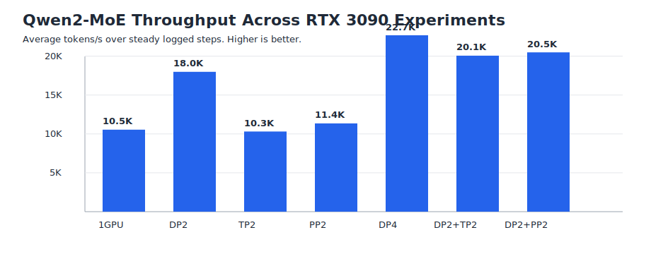
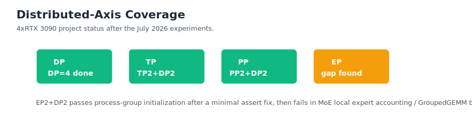

# VLA Training Infrastructure Lab

A practical training-infrastructure lab for Vision-Language-Action (VLA) model training experiments on resource-constrained RTX 3090 hardware.

This repository is organized as a portfolio project for VLA training infrastructure roles. The emphasis is training-system correctness, distributed behavior, memory and throughput measurement, checkpoint reliability, and practical debugging under limited hardware rather than benchmark model quality.

## Target Role Alignment

The project maps directly to common VLA training-infra requirements:

| Requirement | Project coverage |
| --- | --- |
| PyTorch distributed training | Nanotron-based Qwen2-MoE training path, DP=2/4, TP=2, PP=2, 4-GPU DP/TP/PP composition, EP readiness analyzed |
| MoE training | Router top-k, expert token permutation, GroupedGEMM expert MLP, shared expert |
| Mixed precision | BF16 training on RTX 3090 |
| Operator acceleration | FlashAttention and fused RMSNorm/rotary paths where available |
| Checkpoint/resume | Step-5 to step-7, step-500 to step-520, DP step-200 to step-220, TP step-100 to step-120, PP step-100 to step-120 |
| Performance analysis | tokens/s, step time, memory, GPU utilization, power, checkpoint size, scaling efficiency |
| Data pipeline | planned VLA/LeRobot-style data schema and shard strategy |
| Experiment management | structured configs, scripts, troubleshooting notes, result reports |

## Current Status

Completed:

- AutoDL RTX 3090 environment validated with Python 3.10.8, PyTorch 2.1.2+cu118, CUDA toolkit 11.8.
- Nanotron dependencies installed, including `flash-attn==2.5.8` and `grouped_gemm`.
- Nanotron MoE test passed: `PYTHONPATH=src pytest -q tests/test_moe.py`.
- Qwen2-MoE single-GPU smoke run completed for 5 steps.
- Checkpoint resume validated from step 5 to step 7.
- Tiny 20-step and 100-step baseline profiling completed.
- Stronger 75.5M-parameter 500-step baseline profiling completed.
- Step-500 checkpoint resumed to step 520.
- Activation recomputation A/B completed on the 75.5M-parameter baseline v2.
- First 2-GPU data-parallel distributed run completed with checkpoint/resume.
- First 2-GPU tensor-parallel distributed run completed with checkpoint/resume.
- First 2-GPU pipeline-parallel distributed run completed with checkpoint/resume after Qwen2-MoE PP compatibility fixes.
- 4-GPU composition runs completed: DP4, TP2+DP2, and PP2+DP2.
- EP2+DP2 readiness attempt completed; next blocker localized to MoE local expert accounting before GroupedGEMM.
- Compatibility patches documented for PyTorch 2.1.2 collect-env behavior and dummy-data resume metadata.

Latest baseline summary:

| Metric | Value |
| --- | ---: |
| GPU | 1x RTX 3090 24 GiB |
| Model size | 75.5M params |
| MoE | 8 experts, top-k=1, shared expert |
| Parallelism | DP=1, TP=1, PP=1, EP=1 |
| 500-step avg throughput, logged steps >= 50 | 10,544 tokens/s |
| 500-step avg step time, logged steps >= 50 | 49.59 ms |
| Max sampled GPU memory | 2,271 MiB |
| Checkpoint size | 1009 MiB |
| Resume validation | step 500 -> step 520 |
| Recompute A/B | -21.5% throughput, no useful memory win at this scale |
| DP=2 throughput | 17,987 tokens/s total, 8,989 tokens/s/GPU |
| DP=2 resume | step 200 -> step 220 |
| TP=2 throughput | 10,311 tokens/s total, 5,154 tokens/s/GPU |
| TP=2 resume | step 100 -> step 120 |
| PP=2 throughput | 11,357 tokens/s total, 5,674 tokens/s/GPU |
| PP=2 resume | step 100 -> step 120 |
| 4-GPU DP4 throughput | 22,686 tokens/s total, 5,671 tokens/s/GPU |
| 4-GPU TP2+DP2 throughput | 20,071 tokens/s total, 5,019 tokens/s/GPU |
| 4-GPU PP2+DP2 throughput | 20,500 tokens/s total, 5,127 tokens/s/GPU |

See the full reports: [`results/qwen2_moe_4gpu_composition.md`](results/qwen2_moe_4gpu_composition.md), [`docs/scaling_analysis.md`](docs/scaling_analysis.md), [`results/qwen2_moe_pp2_2x3090.md`](results/qwen2_moe_pp2_2x3090.md), [`results/qwen2_moe_tp2_2x3090.md`](results/qwen2_moe_tp2_2x3090.md), [`results/qwen2_moe_dp2_2x3090.md`](results/qwen2_moe_dp2_2x3090.md), [`results/qwen2_moe_baseline_v2_1x3090.md`](results/qwen2_moe_baseline_v2_1x3090.md), and [`results/qwen2_moe_baseline_1x3090.md`](results/qwen2_moe_baseline_1x3090.md).

## Repository Layout

```text
configs/qwen2_moe/       Qwen2-MoE training configs
scripts/                 setup, launch, and profiling scripts
results/                 curated experiment reports
docs/                    design notes, roadmap, experiment matrix, troubleshooting
patches/                 compatibility patches for upstream Nanotron
```

## Quick Start

Clone Nanotron separately on the training machine:

```bash
cd /root/autodl-tmp/vla-infra
git clone https://github.com/huggingface/nanotron.git nanotron
cd nanotron
```

Install the environment following [`scripts/setup_autodl_3090.sh`](scripts/setup_autodl_3090.sh). Then copy a config into the Nanotron checkout:

```bash
mkdir -p examples/smoke
cp /root/autodl-tmp/vla-infra/vla-training-infra-lab/configs/qwen2_moe/config_qwen2_moe_baseline_v2_500step.yaml \
  examples/smoke/config_qwen2_moe_baseline_v2_500step.yaml
```

Run the baseline v2 training:

```bash
CUDA_DEVICE_MAX_CONNECTIONS=1 PYTHONPATH=src torchrun --nproc_per_node=1 \
  run_train.py --config-file examples/smoke/config_qwen2_moe_baseline_v2_500step.yaml
```

## What This Project Can Honestly Claim Today

This project currently validates the single-GPU Qwen2-MoE path, three independent 2-GPU distributed axes, and 4-GPU DP/TP/PP compositions. The covered features include router top-k, expert dispatch inside one rank, GroupedGEMM, FlashAttention, BF16, checkpoint save/resume, 500-step stability, activation recomputation A/B, DP checkpoint/resume, TP checkpoint/resume, PP checkpoint/resume, and coarse profiling.

It does not claim true expert-parallel training yet. EP2+DP2 was tested as a readiness experiment and the next blocker was localized to MoE local expert accounting / token dispatch before GroupedGEMM.

## Figures





## Next Step

The first project is now complete as a 4-GPU training-infrastructure portfolio artifact. The next engineering step would be implementing true EP support: fix EP-aware process-group semantics, map global experts to local experts, dispatch tokens across EP ranks, and feed local expert token counts into GroupedGEMM correctly.
