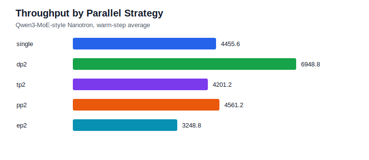
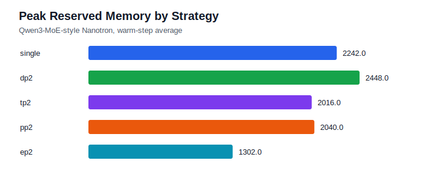
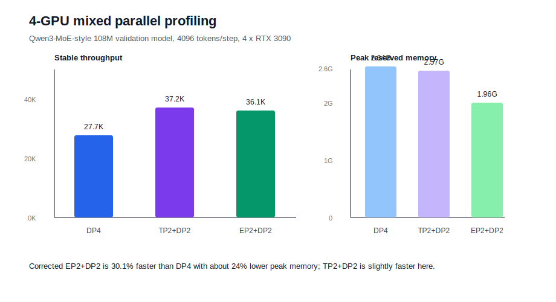

# Project 1: Qwen3-MoE-style Pretraining Infra

This project builds a small but complete Nanotron pretraining-infra lab around a Qwen3-MoE-style model. It is designed to show distributed training understanding rather than train a useful foundation model.

## What It Covers

- Qwen3-MoE-style model adaptation on Nanotron, including QK-Norm-style attention changes and global-batch load-balancing hooks.
- BF16 training, FlashAttention, GroupedGEMM expert MLP, router top-k, activation recomputation, checkpoint/resume.
- Distributed strategies: single GPU, DP2, TP2, PP2, EP2, and earlier 4-GPU DP/TP/PP composition on Qwen2-MoE.
- Outer pretraining engineering: corpus manifest, tokenizer-aware packing, packed shard generation, launch matrix, log parsing, and figure generation.

## Key Results

Clean 20-step Qwen3-MoE-style profiling on AutoDL RTX 3090:

| Strategy | Warm tokens/s | Peak reserved memory |
| --- | ---: | ---: |
| single | 4,455.6 | 2,242 MiB |
| DP2 | 6,948.8 | 2,448 MiB |
| TP2 | 4,201.3 | 2,016 MiB |
| PP2 | 4,561.3 | 2,040 MiB |
| EP2 | 3,248.8 | 1,302 MiB |

Earlier 75.5M Qwen2-MoE 4-GPU profiling:

| Strategy | Total throughput |
| --- | ---: |
| single | 10.5K tokens/s |
| DP4 | 22.7K tokens/s |
| TP2+DP2 | 20.1K tokens/s |
| PP2+DP2 | 20.5K tokens/s |





EP2 token scaling after the real All-to-All dispatcher was enabled:

| Micro-batch | Tokens/step | Warm tokens/s | Peak reserved memory |
| --- | ---: | ---: | ---: |
| mbs2 | 256 | 5,658.8 | 1,302 MiB |
| mbs4 | 512 | 10,840.6 | 1,316 MiB |
| mbs8 | 1024 | 22,962.5 | 1,396 MiB |
| mbs16 | 2048 | 45,737.5 | 1,818 MiB |


4-GPU mixed parallel profiling at the same 4096 tokens/step:

| Strategy | Stable tokens/s | Tokens/s/GPU | Peak reserved memory |
| --- | ---: | ---: | ---: |
| DP4 | 27.73K | 6.93K | 2,642 MiB |
| TP2+DP2 | 37.23K | 9.31K | 2,572 MiB |
| EP2+DP2 | 48.51K | 12.13K | 1,944 MiB |



## Reading Path

- Final report: [`results/project1_qwen3_moe_pretrain_infra_report.md`](results/project1_qwen3_moe_pretrain_infra_report.md)
- Qwen3 distributed validation: [`results/qwen3_moe_style_distributed_validation.md`](results/qwen3_moe_style_distributed_validation.md)
- EP All-to-All dispatch validation: [`results/qwen3_moe_style_ep_alltoall_dispatch.md`](results/qwen3_moe_style_ep_alltoall_dispatch.md)
- EP token scaling study: [`results/qwen3_moe_style_ep_token_scaling.md`](results/qwen3_moe_style_ep_token_scaling.md)
- 4-GPU mixed parallel study: [`results/qwen3_moe_style_4gpu_mixed_parallel.md`](results/qwen3_moe_style_4gpu_mixed_parallel.md)
- Implementation notes: [`docs/implementation_notes.md`](docs/implementation_notes.md)
- Completion checklist: [`docs/project1_completion_checklist.md`](docs/project1_completion_checklist.md)
- 4-GPU composition: [`results/qwen2_moe_4gpu_composition.md`](results/qwen2_moe_4gpu_composition.md)
- Scaling analysis: [`docs/scaling_analysis.md`](docs/scaling_analysis.md)
- Resume bullets: [`docs/project1_resume_bullets.md`](docs/project1_resume_bullets.md)

## EP2 All-to-All Validation

The EP2 path now includes a correctness-oriented token dispatcher:

```text
router top-k -> expert-owner dispatch -> local expert buffer coalesce -> GroupedGEMM -> return dispatch -> scatter-add -> replicated output
```

On 2026-07-10 it completed a fresh 5-step validation, a 20-step no-profile run, and a resume run from step 20 to 22 on 2 x RTX 3090. Warm throughput for the mbs2 20-step run was 5,658.8 tokens/s, peak reserved memory was 1,302 MiB/GPU, and increasing routed tokens per step to 2048 improved throughput to 45,737.5 tokens/s with peak memory still below 1.9 GiB/GPU.

## Reproduction Skeleton

```bash
cd /root/autodl-tmp/vla-infra/nanotron
CUDA_DEVICE_MAX_CONNECTIONS=1 PYTHONPATH=src torchrun --nproc_per_node=4 \
  run_train.py --config-file examples/smoke/config_qwen3_moe_style_100m_ep2dp2_mbs16_100_clean_0710.yaml
```

Use [`scripts/run_project1_nanotron_matrix.sh`](scripts/run_project1_nanotron_matrix.sh) for the smaller single/DP/TP/PP/EP launch matrix.
