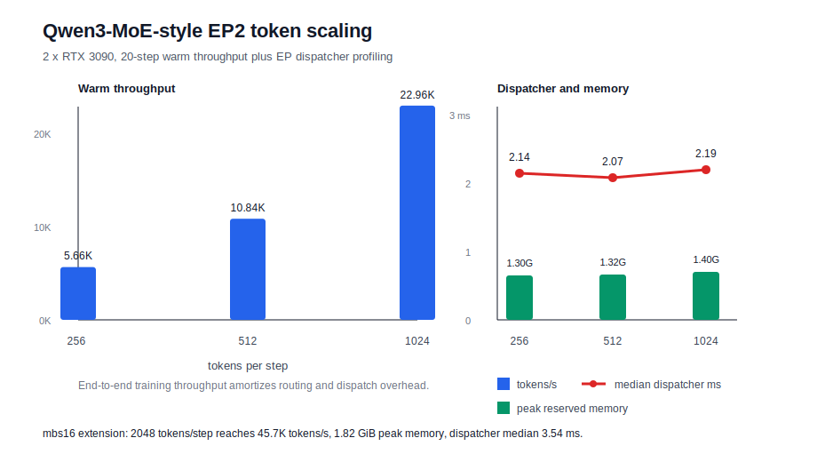

# Qwen3-MoE-style EP Token Scaling Study

> Historical diagnostic only. This sweep predates the differentiable
> All-to-All and shared-gradient synchronization fix. Its throughput values
> must not be used as correct training-performance results. See
> `qwen3_moe_ep_correctness_revalidation.md` for the corrected experiment.

Date: 2026-07-10
Hardware: 2 x RTX 3090 24GB on AutoDL
Software: Python 3.10.8, PyTorch 2.1.2+cu118, Nanotron 0.4

## Goal

After validating that EP2 can run with real token All-to-All dispatch, this study checks whether the EP path behaves like a real systems component rather than a one-off smoke test. The key question is:

> When the number of routed token copies per MoE layer increases, can the fixed routing and dispatch overhead be amortized?

The experiment keeps the model and EP group fixed, then increases micro-batch size:

- mbs2: 256 tokens per training step
- mbs4: 512 tokens per training step
- mbs8: 1024 tokens per training step

Each setting was run as:

- 20-step no-profile training for end-to-end throughput and memory.
- 5-step profiling run with `NANO_QWEN_MOE_EP_PROFILE=1` for dispatcher segment timing.

## End-to-End Throughput

Warm averages exclude the first four initialization-heavy steps.

| Micro-batch | Tokens/step | Warm tokens/s | Warm tokens/s/GPU | Avg step ms | Step>=10 tokens/s | Peak reserved MiB | Final loss |
| --- | ---: | ---: | ---: | ---: | ---: | ---: | ---: |
| mbs2 | 256 | 5,658.8 | 2,828.8 | 45.9 | 5,325.5 | 1,302 | 9.91 |
| mbs4 | 512 | 10,840.6 | 5,423.8 | 47.7 | 10,231.8 | 1,316 | 9.85 |
| mbs8 | 1024 | 22,962.5 | 11,473.8 | 45.1 | 21,609.1 | 1,396 | 9.88 |

An additional mbs16 run was executed to check a larger routed-token shape. The profiling run completed the five training iterations and produced dispatcher timers; its checkpoint save failed afterward because the remote data disk was full, so it is used only for timing, not checkpoint validation.

| Micro-batch | Tokens/step | Warm tokens/s | Warm tokens/s/GPU | Avg step ms | Step>=10 tokens/s | Peak reserved MiB | Final loss |
| --- | ---: | ---: | ---: | ---: | ---: | ---: | ---: |
| mbs16 | 2048 | 45,737.5 | 22,868.8 | 45.5 | 42,254.5 | 1,818 | 9.90 |

## EP Dispatcher Breakdown

The dispatcher numbers are averaged from warm profiled MoE-layer calls.

| Micro-batch | Routed tokens/layer | Full dispatcher ms | Median dispatcher ms | Avg received tokens | Route + count ms | Dispatch A2A ms | Coalesce ms | GroupedGEMM ms | Return A2A ms | Scatter ms | Final all-reduce ms |
| --- | ---: | ---: | ---: | ---: | ---: | ---: | ---: | ---: | ---: | ---: | ---: |
| mbs2 | 256 | 2.847 | 2.144 | 258.8 | 0.667 | 0.186 | 0.225 | 1.024 | 0.226 | 0.064 | 0.242 |
| mbs4 | 512 | 2.075 | 2.073 | 507.5 | 0.616 | 0.169 | 0.208 | 0.420 | 0.146 | 0.061 | 0.245 |
| mbs8 | 1024 | 3.640 | 2.191 | 980.6 | 0.622 | 0.182 | 0.208 | 1.118 | 0.920 | 0.062 | 0.323 |
| mbs16 | 2048 | 3.770 | 3.542 | 2052.3 | 1.638 | 0.290 | 0.208 | 0.418 | 0.462 | 0.067 | 0.483 |



## Interpretation

The EP path has a large fixed-cost component: routing metadata, token sorting, small all-to-all launches, and the compatibility all-reduce after the MoE output. That is why the smallest setting is not throughput-competitive.

As the token count increases, the fixed EP overhead is amortized. Throughput grows from 5.66K tokens/s at mbs2 to 22.96K tokens/s at mbs8, while peak reserved memory only rises from 1.30 GiB to 1.40 GiB. The mbs16 run reaches 45.7K tokens/s with 1.82 GiB peak reserved memory, confirming that larger routed-token batches continue to amortize fixed EP costs. This is the expected behavior for an expert-parallel path: memory benefits arrive early, while throughput only becomes attractive once each expert receives enough tokens.

The dispatcher median remains around 2.1 ms from mbs2 to mbs8, then rises to 3.54 ms at mbs16. At that larger shape the raw dispatch all-to-all is still small, while route/count work, return all-to-all, and the final replication all-reduce become more visible. This suggests the next optimization should focus on metadata packing, tail latency, and reducing synchronization points, not only on expert compute.

## What Was Actually Implemented

The current EP path performs real cross-rank token movement:

```text
router top-k
  -> assign routed token copies to expert-owner ranks
  -> all-to-all hidden states and route metadata
  -> sort received tokens by local expert id
  -> build contiguous expert buffers
  -> GroupedGEMM local expert compute
  -> all-to-all expert outputs back to token-owner ranks
  -> scatter-add by original token id
  -> final replicated output boundary
```

The final all-reduce is intentionally kept as a compatibility boundary so the surrounding non-EP Qwen stack can remain replicated. It is not an ideal EP design for large-scale training, but it makes the small Nanotron integration correct and easy to validate.

## Next Optimization Boundary

The next engineering steps are clear from the measurements:

- Pack token id, local expert id, and route weight into fewer metadata collectives.
- Use async collectives and CUDA streams to overlap token dispatch of one buffer with local expert compute of another buffer.
- Remove or move the final replication all-reduce by carrying sequence-sharded activations through later layers, or by gathering only at required model boundaries.
- Add a larger-token-count benchmark to separate launch overhead from bandwidth-bound all-to-all behavior.

## Resume-Safe Claim

A resume-safe summary of this part is:

> Implemented and profiled an EP2 token dispatcher for a Qwen3-MoE-style Nanotron model: routed token copies are exchanged by expert owner through all-to-all, coalesced into contiguous local expert buffers, computed with GroupedGEMM, and returned to token owners. On 2 x RTX 3090, increasing micro-batch tokens from 256 to 1024 improved EP2 throughput from 5.66K to 22.96K tokens/s with peak memory below 1.4 GiB/GPU; an additional 2048-token clean run reached 45.7K tokens/s at 1.82 GiB/GPU. The profile exposes final replication all-reduce and metadata collectives as the next optimization targets.
