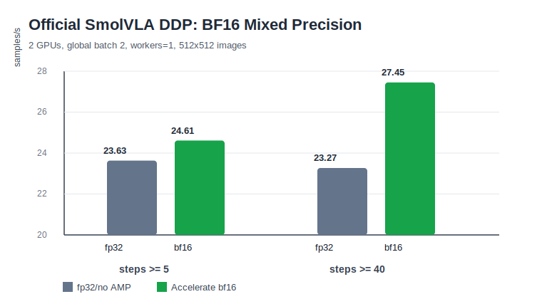

# Project 2: Official SmolVLA DDP BF16 Profile

Date: 2026-07-07

This report compares official LeRobot/SmolVLA DDP training with and without Accelerate BF16 mixed precision.

## Setup

| Item | Value |
| --- | --- |
| Launcher | `accelerate launch --num_processes=2 --multi_gpu` |
| GPUs | 2x RTX 4080 SUPER 32 GiB |
| BF16 support | `torch.cuda.is_bf16_supported() == True` |
| Policy | official `policy.type=smolvla` |
| Model scale | 226M total params, 14M trainable params |
| Dataset | `lerobot/aloha_mobile_cabinet`, episode `[0]` |
| Image size | 512x512 |
| Per-rank batch size | 1 |
| Global batch size | 2 |
| num_workers | 1 |
| Steps per run | 50 |
| Checkpointing | disabled for precision profiling |

## BF16 Invocation

For SmolVLA in this LeRobot version, `--policy.dtype=bfloat16` is not valid:

```text
draccus.utils.DecodingError: `policy`: The fields `dtype` are not valid for SmolVLAConfig
```

The working path is launcher-level Accelerate mixed precision:

```bash
python -m accelerate.commands.launch \
  --num_processes=2 \
  --multi_gpu \
  --mixed_precision=bf16 \
  -m lerobot.scripts.lerobot_train \
  ...
```

The policy config still logs:

```text
policy.use_amp=false
```

This means the run is using Accelerate's outer mixed-precision context rather than a SmolVLA-specific policy dtype field.

## Results

Metrics below are averaged from the official LeRobot logs.

| Precision | Window | Avg samples/s | Avg update s | Avg data s | Max GPU mem |
| --- | --- | ---: | ---: | ---: | ---: |
| fp32/no AMP | steps >= 5 | 23.63 | 0.0825 | 0.0021 | 0.88 GiB |
| bf16 | steps >= 5 | 24.61 | 0.0801 | 0.0020 | 0.88 GiB |
| fp32/no AMP | steps >= 10 | 23.61 | 0.0825 | 0.0021 | 0.88 GiB |
| bf16 | steps >= 10 | 24.27 | 0.0811 | 0.0020 | 0.88 GiB |
| fp32/no AMP | steps >= 40 | 23.27 | 0.0835 | 0.0021 | 0.88 GiB |
| bf16 | steps >= 40 | 27.45 | 0.0713 | 0.0019 | 0.88 GiB |



## Interpretation

BF16 is stable on this 2x RTX 4080 SUPER setup and gives a modest throughput improvement over the 50-step window.

Using the `steps >= 5` window, BF16 improves throughput from `23.63` to `24.61 samples/s`, about `+4.1%`. The late-run window (`steps >= 40`) shows a larger improvement, from `23.27` to `27.45 samples/s`, about `+18.0%`.

The official `gpu_mem_gb` metric remains `0.88 GiB` in both runs. This should not be over-interpreted as "BF16 has no memory effect"; the logged metric is rounded/coarse and the configuration has only 14M trainable parameters with a reduced 2-layer VLM path. A larger policy or more precise `torch.cuda.max_memory_allocated()` instrumentation would be needed for a better memory comparison.

Loss and gradient-norm values are nearly identical across fp32/no-AMP and bf16 runs, which is a useful smoke-level stability signal:

| Precision | Last-step loss | Last-step grad norm |
| --- | ---: | ---: |
| fp32/no AMP | 0.974 | 5.860 |
| bf16 | 0.975 | 5.865 |

## Practical Takeaway

For this official SmolVLA DDP setup:

- `--mixed_precision=bf16` is worth enabling on BF16-capable GPUs.
- The speedup is real but not dramatic at this small model/batch setting.
- Data loading is already hidden with `num_workers=1`, so BF16 mainly affects update time.
- The next optimization target is DDP overhead, especially the conservative `find_unused_parameters=True` default.
