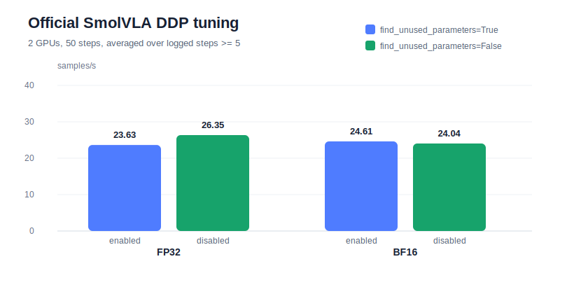

# Project 2: Official SmolVLA DDP Tuning

This report compares the official LeRobot/SmolVLA 2-GPU Accelerate DDP path with and without
`DistributedDataParallelKwargs(find_unused_parameters=True)`.

The goal is not model quality. The goal is to validate one concrete training-infra knob that commonly
appears in conditional or partially frozen VLA policies: whether the extra unused-parameter graph traversal
is still needed once the executed graph is stable.

## Setup

| Item | Value |
| --- | --- |
| Host | AutoDL cloned Project 2 instance |
| GPU | 2x NVIDIA GeForce RTX 4080 SUPER, 32 GiB each |
| PyTorch | 2.8.0+cu128 |
| Framework | Official LeRobot `lerobot-train` via Accelerate DDP |
| Policy | SmolVLA, reduced smoke profile |
| Dataset | `lerobot/aloha_mobile_cabinet`, episode `[0]` |
| Batch | `batch_size=1` per rank, 2 global samples/step |
| Steps | 50 |
| Workers | `num_workers=1` |
| Train mode | `freeze_vision_encoder=true`, `train_expert_only=true`, no VLM weight download |
| Model scale | `num_vlm_layers=2`, `num_expert_layers=2`, `chunk_size=10`, `n_action_steps=10`, `num_steps=2` |

The default official path uses:

```python
DistributedDataParallelKwargs(find_unused_parameters=True)
```

For the tuning run, the remote LeRobot checkout was temporarily patched to:

```python
DistributedDataParallelKwargs(find_unused_parameters=False)
```

After the experiment, the remote LeRobot file was restored to the official default.

## Results

Metrics are averaged from logged steps `>= 5` to skip the first-step startup cost. Memory is the max logged
per-rank CUDA memory.

| Precision | DDP unused-parameter search | Avg samples/s | Avg update time | Avg data time | Max mem/rank |
| --- | --- | ---: | ---: | ---: | ---: |
| FP32 | enabled, official default | 23.63 | 82.5 ms | 2.1 ms | 0.88 GiB |
| FP32 | disabled | 26.35 | 74.5 ms | 1.8 ms | 0.88 GiB |
| BF16 | enabled, Accelerate `--mixed_precision=bf16` | 24.61 | 80.1 ms | 2.0 ms | 0.88 GiB |
| BF16 | disabled | 24.04 | 81.3 ms | 2.1 ms | 0.88 GiB |



## Interpretation

For the FP32 run, disabling unused-parameter detection improves throughput by about **11.5%**
(`23.63 -> 26.35` samples/s). The corresponding average update time drops from 82.5 ms to 74.5 ms.
This matches the expected behavior: when all trainable expert parameters participate in the reduced smoke
graph, DDP's unused-parameter traversal adds overhead but does not improve correctness.

For the BF16 run, disabling the search does not help in this short experiment (`24.61 -> 24.04` samples/s).
This makes the tuning result more realistic: a DDP knob can interact with mixed precision, kernel selection,
and short-run measurement noise. The correct infra practice is to gate this change behind an explicit config
and validate it for the target policy and precision rather than applying it blindly.

The memory number is unchanged at 0.88 GiB/rank. This knob mainly affects graph traversal and reducer
bookkeeping, not activation or optimizer-state memory.

## Resume-Worthy Claim

Implemented and profiled an official LeRobot/SmolVLA 2-GPU DDP fine-tuning path, then benchmarked the DDP
`find_unused_parameters` knob under FP32 and BF16. On the reduced SmolVLA training graph, disabling unused
parameter detection improved FP32 throughput by 11.5% while preserving loss/gradient behavior and memory,
but did not improve the BF16 run, motivating dtype-aware DDP configuration instead of a one-size-fits-all setting.
