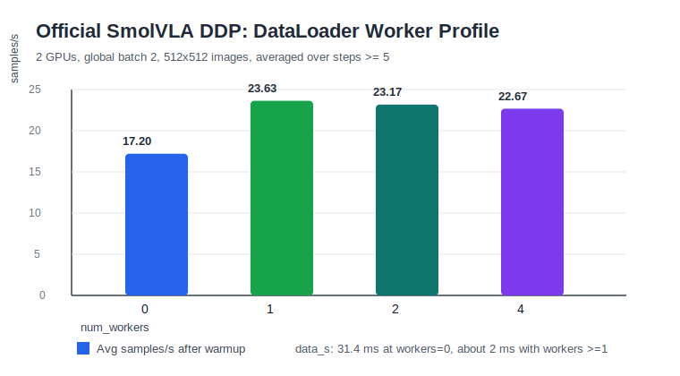

# Project 2: Official SmolVLA DDP DataLoader Worker Profile

Date: 2026-07-07

This report measures how `num_workers` affects official LeRobot/SmolVLA DDP throughput on the same 2-GPU setup used in the 50-step profile.

## Setup

| Item | Value |
| --- | --- |
| Launcher | `accelerate launch --num_processes=2 --multi_gpu` |
| GPUs | 2x RTX 4080 SUPER 32 GiB |
| Policy | official `policy.type=smolvla` |
| Model scale | 226M total params, 14M trainable params |
| Dataset | `lerobot/aloha_mobile_cabinet`, episode `[0]` |
| Image size | 512x512 |
| Per-rank batch size | 1 |
| Global batch size | 2 |
| Steps per run | 50 |
| Checkpointing | disabled for worker profiling |

The compared runs only changed:

```text
--num_workers={0,1,2,4}
```

## Results

Metrics below are averaged over steps `>=5`, after the first-step startup/warmup cost.

| num_workers | Avg samples/s | Avg update s | Avg data s | Max GPU mem |
| ---: | ---: | ---: | ---: | ---: |
| 0 | 17.20 | 0.0858 | 0.0314 | 0.88 GiB |
| 1 | 23.63 | 0.0825 | 0.0021 | 0.88 GiB |
| 2 | 23.17 | 0.0841 | 0.0022 | 0.88 GiB |
| 4 | 22.67 | 0.0860 | 0.0025 | 0.88 GiB |



## Interpretation

`num_workers=0` is clearly slower. Data loading averages `31.4 ms/step`, which is a large fraction of the step time. This means video decode and preprocessing are directly blocking the training process.

`num_workers=1` removes most of that stall: data loading drops to about `2.1 ms/step`, and throughput rises from `17.20` to `23.63 samples/s`.

Increasing to `num_workers=2` or `4` does not improve throughput in this setup. The measured data time stays near `2 ms/step`, while update time remains around `82-86 ms/step`. At this point, the training loop is dominated by forward/backward/optimizer/DDP overhead rather than the dataloader.

The practical setting for this machine and batch size is therefore:

```text
num_workers=1
```

This may change with larger batch size, more cameras, remote storage, heavier transforms, or more GPUs. The main infra lesson is that worker count should be profiled, not assumed. More workers can help until the dataloader is no longer the bottleneck; after that, extra workers mostly add process overhead and memory pressure.

## Relation To Earlier DataLoader Profiling

Earlier low-level profiling showed that raw three-camera video decode benefits strongly from workers. In the official SmolVLA training loop, one worker per rank is already enough to hide most decode latency behind model compute. That difference is expected:

- standalone dataloader profiling measures input pipeline capacity in isolation;
- end-to-end training measures the critical path after overlap with GPU compute;
- once decode is overlapped, model update time dominates.

For VLA training infra, both views are useful. Isolated profiling identifies the data pipeline ceiling; end-to-end profiling identifies whether that ceiling matters for the actual training workload.
