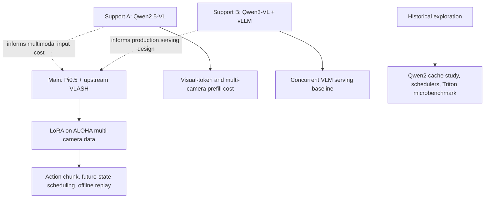

# Project 3: VLA Inference Infra

> Chinese reading guide: [README_CN.md](README_CN.md)

## One Project, One Main Line

The main deliverable is a **Pi0.5 + upstream VLASH delay-robustness study** with
two evidence layers: matched-budget LoRA and held-out action alignment on ALOHA,
followed by paired closed-loop LIBERO ablations of synchronous execution, naive
delay, stale-prefix skipping, delay-augmented training, and learned future state.

The Qwen-VL experiments are supporting system studies. They answer two questions
that arise before a VLA policy enters a robot control loop: how visual inputs
change multimodal serving cost, and how a production VLM engine behaves under
concurrency. They are not presented as robot-policy results.

## Read in This Order

1. **Start here - closed-loop result:**
   [the LIBERO delay report](results/libero_standard_delay_ablation/README_CN.md),
   which reports paired robot-simulation rollouts and bootstrap intervals. Then
   read the [`d=0..4` D4 sweep](results/libero_d4_delay_sweep/README_CN.md) for
   the expanded delay training and same-weight future-state ablation.
2. **Then read the held-out VLA result:**
   [the ALOHA delay-robustness result](results/vlash_delay_ablation/README.md), which
   compares matched-budget Normal Pi0.5 LoRA and VLASH at `d=0/4/8`. Then read
   the [final VLASH report](results/vlash_final/final_vlash_report.md) and its
   [experiment protocol](results/vlash_final/experiment_protocol.md).
3. **Understand the Pi0.5 policy path:**
   [Pi0.5 action inference](results/project3_pi05_vla_action_inference.md).
4. **Understand the VLM serving support studies:**
   [Qwen2.5-VL visual-token study](results/project3_qwen25vl_visual_tokens.md)
   and [Qwen3-VL vLLM serving](results/project3_qwen3vl_vllm_serving.md).
5. **Read only when discussing design alternatives:**
   historical simulations, Qwen2 cache experiments, and Triton microbenchmarks
   listed in [the experiment map](docs/experiment_map_cn.md).

## What Each Model Is For

| Model / component | Role in this project | What it does not prove |
| --- | --- | --- |
| Pi0.5 + VLASH | Main VLA policy path: LoRA, action chunks, future-state scheduling, offline replay | Robot task success or hardware-side acceleration without a robot I/O loop |
| Qwen2.5-VL-3B | Auxiliary VLM study: how one vs. three cameras change visual-token count and prefill cost | A VLA policy or VLASH result |
| Qwen3-VL-4B + vLLM | Auxiliary serving study: concurrency, throughput and memory in a production-oriented VLM engine | Pi0.5/VLASH latency or robot control quality |
| Qwen2 / Qwen3 text models | Early cache and attention-backend methodology experiments | Multimodal or VLA performance |
| Scheduler / paged-KV / prefix-cache simulators | Design-space analysis under declared assumptions | Measured vLLM or robot-side speedup |
| Triton action kernel | Standalone operator-fusion microbenchmark | End-to-end VLA acceleration |

## Current Main Result

| Item | Result |
| --- | --- |
| Data and split | 85 ALOHA episodes / 127,500 frames; fixed 68-episode train / 17-episode held-out split |
| Policy | 3.77B total parameters / 154M trainable LoRA parameters |
| Matched training | 5,000 steps: Normal uses `d=0`; VLASH uses shared observation and delay offsets `0..8` |
| Held-out action alignment | First-action MSE improves by 66.3% at `d=4` and 67.7% at `d=8`; full 50-action chunk MSE improves by 49.0% at `d=8` |
| Scheduling scope | Upstream `VLASHAsyncManager` prefetches at `overlap=4`; quantization ratio 2 makes the effective window 8 steps, inside the trained range |
| LIBERO closed loop | Full policy calls average about 350 ms; at `d=4`, skipping the stale action prefix improves task-3 success from 10% to 50% versus naive delayed execution, paired bootstrap 95% CI `[+10,+70]` percentage points |
| D4 delay training | Stale-D4 and Learned-D4 both complete 5,000-step LoRA and paired `d=0..4` rollouts; Learned-D4 success declines from 50% at sync to 30% at `d=4` |
| Learned-state boundary | With identical Learned-D4 weights, predicted state reduces handoff L2 by about 1.5%--5.6% across `d=1..4`, but does not improve closed-loop success |
| Important boundary | LIBERO is simulation, not a physical robot; 87.7 ms synthetic warmed inference and about 350 ms full LIBERO policy calls are different measurement conditions |

## Evidence and Source Layout

- `vlash_reproduction/`: reproducible upstream configurations, compatibility patch,
  and replay adapter.
- `results/vlash_final/`: final checkpoint logs, replay CSVs, figures, experimental
  conditions, and conclusions. This is the source of final VLA claims.
- `results/libero_standard_delay_ablation/`: closed-loop episode records, paired
  bootstrap analyses, and the detailed Chinese report.
- `results/libero_d4_delay_sweep/`: D4 training configs, paired `d=0..4`
  episode records, bootstrap analysis, figure, and detailed Chinese report.
- `results/project3_qwen25vl_*.md`: supporting visual-token and prefill studies.
- `results/project3_qwen3vl_vllm_serving.md`: supporting vLLM serving study.
- `results/project3_final_report.md`: dated historical umbrella report. Its simulator
  results are explicitly not used as final VLASH claims.
- `benchmarks/` and `simulators/`: scripts and prototypes behind supporting studies.

Large models, datasets, checkpoints, credentials, and uncurated raw logs are
intentionally excluded from Git.
