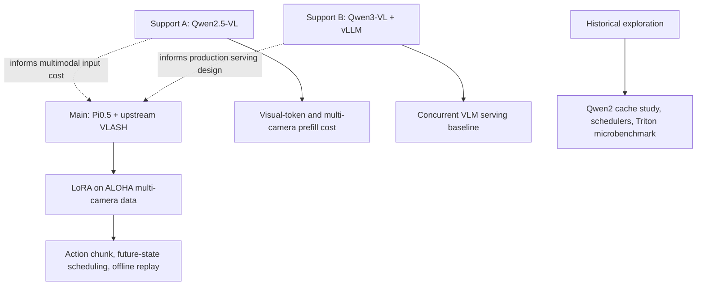
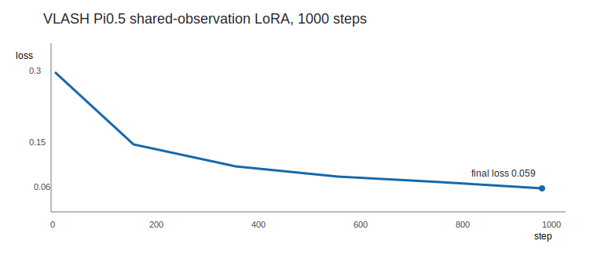

# Project 3: VLA Inference Infra

> Chinese reading guide: [README_CN.md](README_CN.md)

## One Project, One Main Line

The main deliverable is an **upstream VLASH reproduction on a real Pi0.5 VLA
policy**: LoRA fine-tuning on ALOHA multi-camera data, followed by replay through
the upstream action-chunk and future-state scheduling manager.

The Qwen-VL experiments are supporting system studies. They answer two questions
that arise before a VLA policy enters a robot control loop: how visual inputs
change multimodal serving cost, and how a production VLM engine behaves under
concurrency. They are not presented as robot-policy results.

## Read in This Order

1. **Start here - actual VLA result:**
   [final VLASH report](results/vlash_final/final_vlash_report.md) and its
   [experiment protocol](results/vlash_final/experiment_protocol.md).
   The held-out `d=0/4/8` action-alignment ablation is documented in
   [the delay-robustness result](results/vlash_delay_ablation/README.md).
2. **Understand the Pi0.5 policy path:**
   [Pi0.5 action inference](results/project3_pi05_vla_action_inference.md).
3. **Understand the VLM serving support studies:**
   [Qwen2.5-VL visual-token study](results/project3_qwen25vl_visual_tokens.md)
   and [Qwen3-VL vLLM serving](results/project3_qwen3vl_vllm_serving.md).
4. **Read only when discussing design alternatives:**
   historical simulations, Qwen2 cache experiments, and Triton microbenchmarks
   listed in [the experiment map](docs/experiment_map_cn.md).

## What Each Model Is For

| Model / component | Role in this project | What it does not prove |
| --- | --- | --- |
| Pi0.5 + VLASH | Main VLA policy path: LoRA, action chunks, future-state scheduling, offline replay | Robot task success or hardware-side acceleration without a robot I/O loop |
| Qwen2.5-VL-3B | Auxiliary VLM study: how one vs. three cameras change visual-token count and prefill cost | A VLA policy or VLASH result |
| Qwen3-VL-4B + vLLM | Auxiliary serving study: concurrency, throughput and memory in a production-oriented VLM engine | Pi0.5/VLASH latency or robot control quality |
| Qwen2 / Qwen3 text models | Early cache and attention-backend methodology experiments | Multimodal or VLA performance |
| Scheduler / paged-KV / prefix-cache simulators | Design-space analysis under declared assumptions | Measured vLLM or robot-side speedup |
| Triton action kernel | Standalone operator-fusion microbenchmark | End-to-end VLA acceleration |

## Current Main Result

| Item | Result |
| --- | --- |
| Data and training | Upstream VLASH Pi0.5 LoRA on 85 ALOHA episodes / 127,500 frames |
| Policy | 3.77B total parameters / 154M trainable LoRA parameters |
| Training | 1,000 steps, shared observation with delay offsets 0..8 |
| Policy replay | Final checkpoint replayed with the upstream `VLASHAsyncManager` in sync, async, and quantization-ratio-2 modes |
| Key runtime distinction | Action-chunk refill is expensive; an existing chunk is served by about 0.05 ms queue pops |

## Evidence and Source Layout

- `vlash_reproduction/`: reproducible upstream configurations, compatibility patch,
  and replay adapter.
- `results/vlash_final/`: final checkpoint logs, replay CSVs, figures, experimental
  conditions, and conclusions. This is the source of final VLA claims.
- `results/project3_qwen25vl_*.md`: supporting visual-token and prefill studies.
- `results/project3_qwen3vl_vllm_serving.md`: supporting vLLM serving study.
- `results/project3_final_report.md`: dated historical umbrella report. Its simulator
  results are explicitly not used as final VLASH claims.
- `benchmarks/` and `simulators/`: scripts and prototypes behind supporting studies.

Large models, datasets, checkpoints, credentials, and uncurated raw logs are
intentionally excluded from Git.
