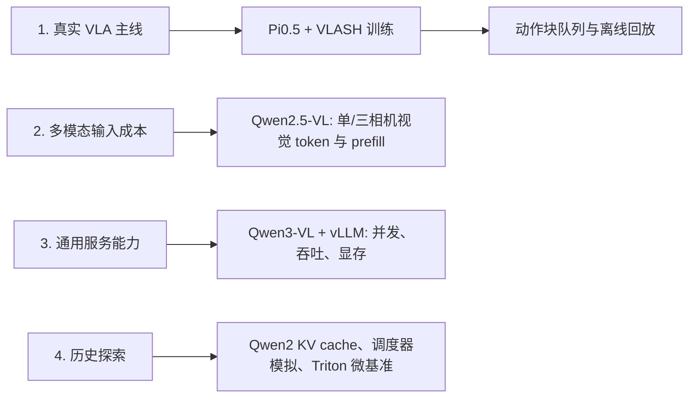
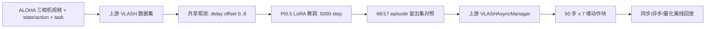

# 项目三：VLA 推理基础设施与 VLASH 复现

> English guide: [README.md](README.md)

## 先用一句话讲清楚

这是一个以 **Pi0.5 + VLASH 时延鲁棒性训练与异步动作块调度** 为主线的 VLA 训推协同项目。

最终交付不是“把几个 Qwen 模型都跑了一遍”，而是：在 ALOHA 三相机机器人数据上，
完成上游 VLASH 的 Pi0.5 LoRA 微调、共享观测延迟增强、episode 留出集动作对齐验证、
动作块队列和未来状态调度的策略级离线回放；再用两个 Qwen-VL 实验补充说明多模态输入和
通用 VLM 服务在系统层面的成本。

## 建议阅读顺序



1. **先读核心留出集结果**：
   [延迟鲁棒性实验](results/vlash_delay_ablation/README.md)。它给出相同预算 Normal Pi0.5
   LoRA 与 VLASH 的 `d=0/4/8` 对照，是本项目的主要性能证据。
2. **再看训练和调度机制**：
   [VLASH Pi0.5 复现结果与推理分析](results/vlash_final/final_vlash_report.md)、
   [实验条件与结果阅读说明](results/vlash_final/experiment_protocol.md) 和
   [未来状态对齐说明](results/vlash_final/future_state_alignment.md)。
3. **理解 Pi0.5 本身的动作推理路径**：
   [Pi0.5 动作块推理基准](results/project3_pi05_vla_action_inference.md)。
4. **最后再读两个辅助实验**：
   [Qwen2.5-VL 多相机视觉 token 与 prefill](results/project3_qwen25vl_visual_tokens.md)、
   [Qwen3-VL vLLM 并发服务](results/project3_qwen3vl_vllm_serving.md)。

如果想知道所有实验在整条链路中的位置，读
[实验地图](docs/experiment_map_cn.md)。

## 这些模型之间是什么关系

| 内容 | 在项目中的角色 | 回答的问题 | 不应被误解为 |
| --- | --- | --- | --- |
| **Pi0.5 + VLASH** | 主线、最终成果 | 真实 VLA 策略如何完成 LoRA 微调、生成动作块、使用未来状态调度并进行回放 | 已证明实体机器人成功率或硬件端加速 |
| **Qwen2.5-VL-3B** | 辅助实验 A | 单相机和三相机输入为何会显著拉高视觉 token 与多模态 prefill 成本 | 一个 VLA 策略或 VLASH 的性能结果 |
| **Qwen3-VL-4B + vLLM** | 辅助实验 B | 通用 VLM 在并发服务下的吞吐、时延、显存边界 | Pi0.5/VLASH 的控制时延 |
| **Qwen2/Qwen3 纯文本模型** | 早期方法探索 | KV cache、prefill/decode 拆分、注意力后端的测量方法 | 多模态或 VLA 性能结论 |
| **Paged KV、prefix cache、调度器模拟** | 设计空间探索 | 在明确假设下讨论批处理和缓存的影响 | vLLM 或机器人端的实测加速 |
| **Triton 动作后处理** | 算子微基准 | 融合反归一化、截断、掩码的可行性 | 端到端 VLA 加速 |

## 主线：Pi0.5 + VLASH 到底完成了什么



| 主线指标 | 本次结果 |
| --- | --- |
| 数据 | `lerobot/aloha_mobile_cabinet`，85 个 episode、127,500 帧、三路相机 |
| 策略 | Pi0.5，3.77B 总参数、154M 可训练 LoRA 参数 |
| 对照训练 | 同一 Pi0.5 基座、LoRA 配置和 5,000 step：Normal 为 `d=0`，VLASH 为 shared observation、`d=0..8` |
| 留出集 | 固定 seed 1000 按 episode 划分 68 训练 / 17 验证；在 34 个验证样本上评测 `d=0/4/8` |
| 核心结果 | `d=4/d=8` 首动作 MSE 分别降低 66.3% / 67.7%；`d=8` 完整 50 步动作块 MSE 降低 49.0% |
| 推理调度 | 50 步动作块剩余 `overlap=4` 步时预取下一块；量化比 2 时有效窗口为 8 步，未超出训练延迟范围 |
| 性能边界 | Pi0.5 动作块 warm 前向约 87.7 ms；真实 I/O、模型预测代理和闭环成功率未在本实验中测量 |


## 两个辅助实验为什么仍然保留

### Qwen2.5-VL：回答“多相机为什么难服务”

真实 VLA 常常不止一张相机图像。这个实验用 Qwen2.5-VL 定量展示视觉输入规模如何
改变模型前缀计算：从单相机到三相机，视觉 marker token 从 66 增至 774，prefill 从
40.3 ms 增至 166.4 ms。它不替代 Pi0.5，只是给“多相机输入为什么可能成为系统瓶颈”
一个可测的 VLM 参照。

### Qwen3-VL + vLLM：回答“服务引擎在并发下表现如何”

这个实验选用 vLLM 来测并发调度，而不是手写一个 serving engine。它给的是通用 VLM
服务基准：在 32 GiB GPU 上，concurrency 8 时，224px 图像为 10.08 req/s，448px 图像
为 8.73 req/s。它反映 vLLM 的服务能力，不能与 Pi0.5 的动作块延迟直接横向比较。

## 历史探索：保留，但不作为最终结论

- Qwen2/Qwen3 文本模型实验：用于建立 KV cache、prefill/decode 和 attention backend
  的分析方法。
- Paged KV、prefix cache、连续批处理与调度器：均为**模拟**，用于讨论设计空间。
- Triton 动作后处理：是独立小算子基准，而非 VLASH 核心路径。
- 早期“30 Hz 反应延迟 266.7 ms 到 166.7 ms”和“动作量化节省 50%”同样是模拟器结果，
  已不作为最终 VLASH 性能结论。

更完整的归类和每项实验的输入、输出、可信结论与限制见
[实验地图](docs/experiment_map_cn.md)。

## 仓库结构

```text
vlash_reproduction/        主线配置、上游兼容补丁、回放 adapter
results/vlash_final/       最终训练日志、回放 CSV、图、实验条件、结论
results/project3_qwen25*   Qwen2.5-VL 多模态输入成本辅助实验
results/project3_qwen3vl*  Qwen3-VL vLLM 并发服务辅助实验
benchmarks/                基准脚本
simulators/                历史设计空间模拟器
assets/figures/            可复核图表
```

模型权重、数据集、checkpoint、凭据和未整理原始日志不上传到仓库。
