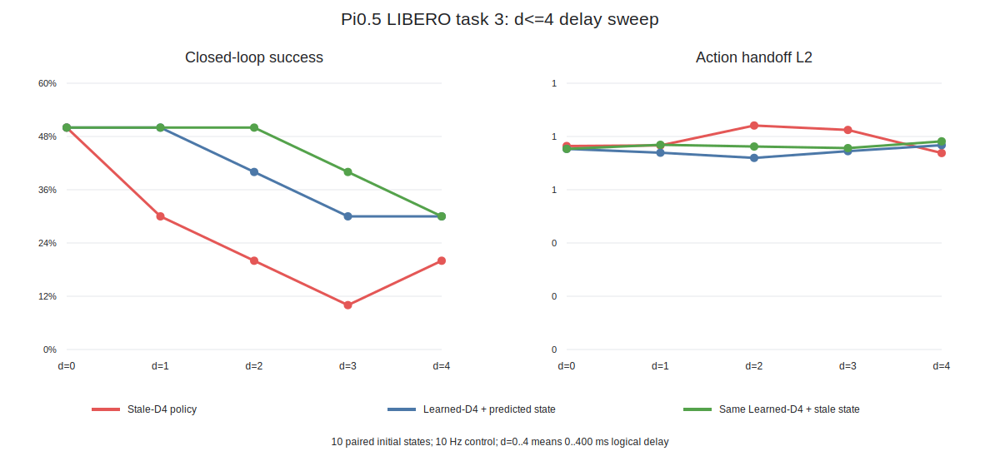

# Pi0.5 / VLASH D4 延迟闭环扫描

## 1. 实验问题

这组实验回答两个彼此不同的问题：

1. 将 Pi0.5 的延迟增强范围从 `d=0..2` 扩展到 `d=0..4` 后，策略能否在
   100--400 ms 的逻辑延迟下保持闭环能力？
2. 在**完全相同的 Learned-D4 策略权重**上，把预测未来状态送入策略，是否比继续使用
   滞后状态更好？

第二个问题才是未来状态预测器的直接消融。Learned-D4 与 Stale-D4 使用了不同的 LoRA
训练条件，因此两套权重之间的结果只能作为系统级参考，不能把差异全部归因于预测器。

## 2. 实验条件

| 项目 | 设置 |
| --- | --- |
| 基座 | `lerobot/pi05_base`，Pi0.5，约 3.77B 参数 |
| 微调 | LoRA，5,000 step，`r=16`，共享观测编码开启 |
| Stale-D4 | `max_delay_steps=4`，`future_state_mode=stale` |
| Learned-D4 | `max_delay_steps=4`，`future_state_mode=learned`，加载已训练状态预测器 |
| 仿真 | LIBERO Spatial，task 3：将饼干盒上的黑碗放到盘子上 |
| 初态 | 每个条件使用相同的 10 个初态与随机种子 `1000..1009` |
| 控制周期 | 10 Hz，即每个 tick 为 100 ms |
| 重规划 | 每 10 tick 生成一个新的动作块 |
| 延迟 | `d=0..4`，对应 0、100、200、300、400 ms 逻辑延迟 |
| 统计 | episode 成功率、完成步数、完整策略调用时延、动作交接 L2、状态预测 MSE、队列欠载 |
| 区间 | 20,000 次 episode 配对 bootstrap，报告候选条件减参考条件的 95% 区间 |

这里的延迟评测在同一进程中按时间语义模拟动作块迟到与状态错位，属于**逻辑异步闭环**；
它尚不是独立推理线程和控制线程并发运行的生产级异步执行器。

## 3. 三条对照曲线

- **Stale-D4 policy**：用 `future_state_mode=stale` 训练的独立策略。
- **Learned-D4 + predicted state**：用 `future_state_mode=learned` 训练，并在推理时输入预测未来状态。
- **Same Learned-D4 + stale state**：保持 Learned-D4 权重不变，仅在推理时关闭未来状态替换。

`d=0` 不需要预测未来状态，所以 Learned-D4 的后两条曲线共用同一组同步结果。

## 4. 聚合结果

### 4.1 闭环成功率

| 条件 | d=0 | d=1 | d=2 | d=3 | d=4 |
| --- | ---: | ---: | ---: | ---: | ---: |
| Stale-D4 | 50% | 30% | 20% | 10% | 20% |
| Learned-D4 + 预测状态 | 50% | 50% | 40% | 30% | 30% |
| 同一 Learned-D4 + 滞后状态 | 50% | 50% | 50% | 40% | 30% |

Stale-D4 从同步的 50% 随延迟总体下降；`d=4` 从 10% 回升到 20% 很可能来自仅 10 个
初态的离散波动，不应解释成 400 ms 比 300 ms 更容易。Learned-D4 的系统级结果在 `d=1..4`
比 Stale-D4 高 10--20 个百分点，但所有配对区间均跨 0，当前样本量不足以形成显著结论。

### 4.2 平均 episode 步数

| 条件 | d=0 | d=1 | d=2 | d=3 | d=4 |
| --- | ---: | ---: | ---: | ---: | ---: |
| Stale-D4 | 189.2 | 226.0 | 245.0 | 264.8 | 244.2 |
| Learned-D4 + 预测状态 | 210.7 | 237.2 | 215.4 | 233.2 | 235.2 |
| 同一 Learned-D4 + 滞后状态 | 210.7 | 236.6 | 215.7 | 230.8 | 244.9 |

失败回合会运行到 280 步上限，因此“平均步数更少”同时受成功率和成功速度影响，不能单独当作
控制质量指标。

### 4.3 策略调用与状态预测

| 延迟 | Learned-D4 预测状态 MSE | 预测状态调用时延 | 同权重滞后状态调用时延 |
| --- | ---: | ---: | ---: |
| d=1 | 0.00000947 | 389.2 ms | 386.0 ms |
| d=2 | 0.00002402 | 382.8 ms | 389.1 ms |
| d=3 | 0.00004078 | 387.4 ms | 387.5 ms |
| d=4 | 0.00008241 | 392.4 ms | 390.9 ms |

预测误差随预测跨度增大而上升，符合多步动力学误差累积的预期。完整策略调用约
349--392 ms；表中几毫秒级波动混合了 GPU、仿真和输入差异，不能直接视为预测器开销。
所有条件的队列欠载次数均为 0。

## 5. 同权重未来状态消融

下面只比较 Learned-D4 的同一份权重，因此能隔离“推理时是否使用预测未来状态”这一变量。

| 延迟 | 成功率差（预测 - 滞后） | 95% 区间 | 动作交接 L2 差 | 95% 区间 |
| --- | ---: | ---: | ---: | ---: |
| d=1 | 0 个百分点 | [-40, +40] | -0.0357 | [-0.1344, +0.0566] |
| d=2 | -10 个百分点 | [-40, +20] | -0.0513 | [-0.1390, +0.0527] |
| d=3 | -10 个百分点 | [-40, +20] | -0.0138 | [-0.1388, +0.1051] |
| d=4 | 0 个百分点 | [-40, +40] | -0.0172 | [-0.1737, +0.1605] |

预测未来状态在四个延迟点都降低了动作交接 L2，平均降幅约 1.5%--5.6%，方向一致；但区间
全部跨 0，而且没有转化为成功率提升。当前证据支持“动作块交接略平滑”，不支持“未来状态
预测提高闭环成功率”。

## 6. 结论与边界

1. **D4 延迟训练链路已跑通。** Stale-D4 与 Learned-D4 均完成 5,000-step LoRA，
   `d=0..4` 闭环扫描、同初态配对和断言检查均完成。
2. **延迟确实是系统瓶颈。** Stale-D4 的成功率随延迟总体从 50% 降至 10%--20%，完整策略
   调用约 350--392 ms，而控制周期仅 100 ms。
3. **Learned-D4 权重整体更耐延迟，但因训练权重不同，不能归因于预测器。** 相对 Stale-D4
   的成功率高 10--20 个百分点只是参考趋势，bootstrap 区间仍跨 0。
4. **预测未来状态尚未带来闭环收益。** 同权重消融中，它小幅降低动作交接跳变，但成功率
   与滞后状态相同或更低。这说明状态 MSE 很小并不等价于策略有用性：视觉仍来自旧时刻，
   预测状态存在分布偏移，而且任务成功由接触阶段误差决定。
5. **当前最稳健的部署结论仍是动作时序对齐。** 已验证的标准策略实验中，`d=4` 跳过过期
   动作前缀把成功率从 10% 提升到 50%；相比之下，状态预测器仍需真实并发执行器和更多闭环
   样本验证。

## 7. 文件说明

- `delay_sweep_episodes.csv`：Stale-D4 `d=0..3`、Learned-D4 两种输入 `d=1..3` 的原始回合。
- `learned_d4_sync_episodes.csv`：Learned-D4 的 `d=0` 同步锚点。
- `../libero_d4_policy_pair/episodes.csv`：三组条件的 `d=4` 原始回合。
- `d4_delay_analysis.json`：聚合指标与 20,000 次配对 bootstrap 结果。
- `d4_training_overrides.yaml`：基于已有 `d<=2` 配置生成两次 D4 微调时使用的差异项。
- `../../vlash_reproduction/scripts/analyze_libero_d4_delay_sweep.py`：可复现分析脚本。
