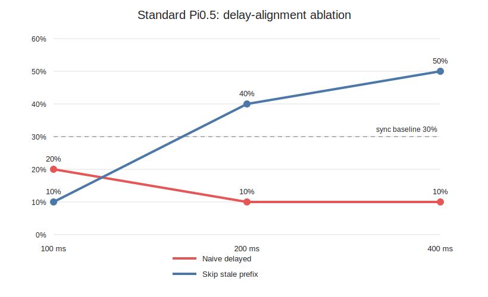
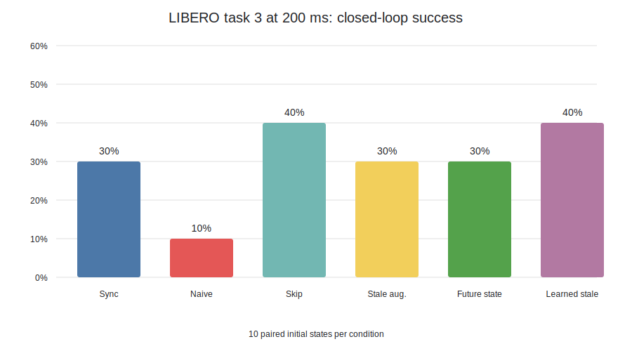

# Pi0.5 / VLASH LIBERO 闭环时延实验

## 1. 实验目的

本实验补上此前 ALOHA 留出轨迹评测缺失的闭环证据，回答三个问题：

1. Pi0.5 推理晚到若干控制周期后，继续从动作块开头执行会造成多大影响？
2. 不重新训练模型，只跳过已经过时的前 `d` 个动作，能否恢复闭环性能？
3. VLASH 风格的延迟增强训练和学习式未来状态输入，是否进一步改善任务成功率？

本实验是 LIBERO 仿真闭环，不是实体机器人实验，也不把仿真成功率外推为实机成功率。

## 2. 策略与训练条件

三组策略均从同一通用 Pi0.5 基座开始，采用 LoRA 微调，训练 `5,000` step：

| 策略 | 训练输入与监督 | 用途 |
| --- | --- | --- |
| Standard LoRA | 当前图像、任务和状态 `s_t`，预测从当前时刻开始的 50 步动作块 | 无延迟任务适配基线 |
| Stale delay-augmented LoRA | 共享当前观测，对 `d=0..2` 的未来动作 offset 提供监督，状态仍使用滞后状态 | 判断时延增强监督本身的作用 |
| Learned future-state LoRA | 同样覆盖 `d=0..2`，但使用 GRU 状态预测器给出的 `s_hat(t+d)` | 判断未来状态补偿的作用 |

状态预测器输入当前 8 维机器人状态、接下来一段 7 维动作前缀和预测 horizon。留出数据上，
它相对简单代理在 `d=1/2/4` 的状态 MSE 分别降低 `86.06% / 92.78% / 94.66%`。
这只能说明状态回归准确，不能自动推出闭环任务成功率提高。

## 3. 闭环评测器

评测器运行真实 Pi0.5 策略和 LIBERO 环境，并以逻辑控制 tick 模拟推理延迟：

```text
观测 I_t, s_t
    -> 发起 Pi0.5 推理请求
    -> 推理等待期间继续消费旧动作队列
    -> d 个 tick 后新动作块就绪
    -> 替换旧队列剩余动作
    -> 继续执行直到成功或达到 280 step
```

LIBERO 控制频率为 `10 Hz`，一个 tick 为 `100 ms`。本机完整闭环 Pi0.5 调用平均约
`340-366 ms`，因此真实计算时间大约跨越 `3-4` 个 tick；`d=4` 是最接近本机实测
推理时延的离散档位。

标准策略有三种部署语义：

- **同步：** 新动作块立刻生效，用于测策略本身的任务能力。
- **朴素延迟：** 等待 `d` 个 tick 后，仍从动作块第 0 项开始执行；动作语义已经落后于环境。
- **动作跳步：** 等待 `d` 个 tick 后，从动作块第 `d` 项开始执行，丢弃已经过时的前缀。

评测固定 `libero_spatial` task 3、相同的 episode index `0..9` 和 seed `1000..1009`，
每个条件 10 个配对 episode。动作每 10 tick 重新规划，所有条件队列欠载均为 0。

## 4. 标准策略的延迟扫描

| 部署方式 | 同步 | 100 ms | 200 ms | 400 ms |
| --- | ---: | ---: | ---: | ---: |
| Standard 同步 | 30% | - | - | - |
| Standard 朴素延迟 | - | 20% | 10% | 10% |
| Standard 动作跳步 | - | 10% | 40% | 50% |



最清晰的机制结果出现在 `d=4`：动作跳步相对朴素延迟将成功率从 `10%` 提升到 `50%`，
配对 bootstrap 95% 区间为 `[+10, +70]` 个百分点；平均 episode 步数从 `276.3`
降低到 `204.8`，配对差值为 `-71.5`，95% 区间为 `[-119.2, -24.3]`。

这不是模型前向加速，而是**动作时序对齐优化**：推理仍需约 350 ms，但结果到达时不再执行
已经过期的动作前缀。`d=1/2` 的成功率差值区间仍跨 0，只能报告趋势。

## 5. 200 ms 下的完整策略矩阵

| 条件 | 成功率 | 平均步数 | 平均推理 | 动作交接 L2 |
| --- | ---: | ---: | ---: | ---: |
| Standard 同步 | 30% | 239.8 | 347.9 ms | 0.940 |
| Standard 朴素延迟 | 10% | 263.1 | 346.9 ms | 0.923 |
| Standard 动作跳步 | 40% | 222.3 | 349.6 ms | 1.049 |
| Stale 延迟增强 | 30% | 231.3 | 353.6 ms | 0.845 |
| Learned + 未来状态 | 30% | 230.9 | 365.8 ms | 0.857 |
| 同一 Learned 权重 + 滞后状态 | 40% | 235.8 | 358.5 ms | 0.895 |



### 同一权重可以归因的结果

- Standard 的朴素延迟相对同步从 `30%` 降到 `10%`，但 10 对样本的区间为
  `[-60, +20]` 个百分点。
- Standard 动作跳步相对朴素延迟从 `10%` 升到 `40%`，区间为 `[-10, +70]`。
- 同一 Learned 权重下，未来状态输入将动作交接 L2 从 `0.895` 降到 `0.857`，改善约
  `4.3%`；成功率却从 `40%` 变为 `30%`，区间为 `[-40, +20]`。

因此，未来状态预测表现出更平滑的动作交接趋势，但本实验没有证明它提升闭环成功率。

### 不同权重只能作为相关证据

Stale 延迟增强模型在 200 ms 下为 `30%`，高于 Standard 朴素延迟的 `10%`；Learned
未来状态模型同样为 `30%`。这些策略来自独立 LoRA 训练，而且共享观测训练一次更新监督
多个 offset，Standard 一次更新只监督一个 offset，因此差异同时包含监督量和优化随机性，
不能全部归因于某一个未来状态机制。

## 6. 为什么状态预测准确却没有提高成功率

1. **图像与状态不同步。** Learned 路径替换了状态为 `s_hat(t+d)`，图像仍来自 `I_t`，
   形成未来本体状态与旧视觉观测的跨模态错位。
2. **动作分布偏移。** 状态预测器在数据集动作上训练，闭环时输入来自策略自身的动作队列；
   一旦策略偏离示范轨迹，预测误差会沿控制循环累积。
3. **接触任务敏感。** 抓取和放置对夹爪接触、物体姿态与视觉误差敏感，较低的状态 MSE
   不等于更正确的接触动作。
4. **策略能力有限。** Standard 在全 10 个 Spatial 任务各一个初态的初筛为 `0/10`；扩展
   task 3 到 10 个初态后为 `3/10`，task 9 为 `0/10`。弱基线会放大闭环方差。
5. **样本量较小。** 除 `d=4` 动作跳步对朴素延迟外，多数 bootstrap 区间跨 0。

## 7. 可以与不可以得出的结论

可以得出：

- 当前 32 GiB GPU 上，完整 Pi0.5 LIBERO 策略调用约为 `350 ms`，明显慢于 10 Hz 控制 tick。
- 朴素异步存在动作块时序错位；按已消耗 tick 跳过动作前缀是必要且有效的强基线。
- `d=4` 时动作跳步相对朴素延迟取得统计上为正的闭环成功率和完成步数改善。
- 学习式未来状态改善了动作交接连续性趋势，但没有转化为成功率提升。

不可以得出：

- VLASH 已在实体机器人上提升任务成功率。
- 未来状态预测必然优于动作跳步。
- 350 ms 是纯模型 kernel 时间；它是完整策略调用条件下的测量值。
- 跨 LoRA 权重的成功率差异完全来自延迟增强或未来状态输入。

## 8. 复现文件

- `standard_sync_episodes.csv`：Standard 同步 task 3/9 原始 episode。
- `standard_delay_episodes.csv`：Standard 朴素延迟与动作跳步原始 episode。
- `stale_d2_episodes.csv`：Stale 延迟增强策略原始 episode。
- `standard_delay_analysis.json`：延迟扫描的聚合与 bootstrap。
- `d2_policy_matrix_analysis.json`：200 ms 完整策略矩阵。
- `vlash_reproduction/scripts/evaluate_libero_closed_loop.py`：闭环队列和逻辑延迟评测器。
- `vlash_reproduction/scripts/analyze_libero_standard_delay.py`：标准策略配对分析。
- `vlash_reproduction/scripts/analyze_libero_d2_policy_matrix.py`：完整策略矩阵分析。
- `vlash_reproduction/configs/pi05_libero_standard_5000.yaml`：Standard 实际训练配置，路径已脱敏。
- `vlash_reproduction/configs/pi05_libero_stale_5000.yaml`：Stale 延迟增强实际训练配置。
- `vlash_reproduction/configs/pi05_libero_learned_5000.yaml`：Learned 未来状态实际训练配置。

模型、LoRA checkpoint、LIBERO 数据和训练日志体积较大，不上传仓库。
