# Project 3 Final Report: VLM/VLA-Style Inference Profiling and Triton Kernel

Date: 2026-07-08

Project 3 now uses `Qwen/Qwen2.5-VL-3B-Instruct` to add real image input, visual tokens, and a lightweight serving prototype to the inference path. The earlier `Qwen/Qwen3-0.6B` benchmark is retained as a language-backbone decode sub-experiment, but the main VLA-style claim is now grounded in a VLM path:

```text
camera image(s) -> Qwen2.5-VL processor -> visual tokens + task text -> multimodal prefill -> decode -> action post-processing
```

The project is not a full robot policy and does not claim real control quality. It is an inference-infrastructure lab for measuring multimodal prefill, visual-token cost, cached generation behavior, attention backend choices, GPU memory, and VLA-style action post-processing.

## Completed Scope

| Area | Completed work |
| --- | --- |
| VLM backbone | Qwen2.5-VL-3B-Instruct BF16 multimodal inference benchmark |
| Visual input | synthetic single-camera and three-camera image inputs |
| Visual-token profiling | image count / image size / pixel budget vs input tokens, prefill latency, TTFT, memory |
| Serving prototype | visual input cache, shape-aware microbatching, KV cache memory accounting |
| Paged KV simulator | block manager, continuous batching, guarded paged admission, KV budget sweep |
| VLA scheduling | shape-aware batching, token-budget batching, prefix-cache simulation, padding waste analysis |
| Language decode subtest | Qwen3-0.6B prefill/decode, KV-cache, attention backend comparison |
| VLA action path | simplified hidden-state-to-action head plus Pi0.5 real action chunk inference |
| VLA control loop | VLASH-inspired async action-queue simulator with future-state refill and action quantization |
| Triton kernel | fused action denormalization, clamp, and mask select |
| Reporting | raw CSVs, SVG figures, final summary, resume bullets |

## Environment

| Item | Value |
| --- | --- |
| GPU | NVIDIA GeForce RTX 4080 SUPER, 32 GiB |
| Python | 3.12.3 |
| PyTorch | 2.8.0+cu128 |
| CUDA runtime | 12.8 |
| flash-attn | 2.8.3 |
| VLM model | `Qwen/Qwen2.5-VL-3B-Instruct` |
| Language subtest model | `Qwen/Qwen3-0.6B` |
| dtype | BF16 |
| Model source | ModelScope cache |

## Stage 1: Qwen2.5-VL Visual Token Profiling

The benchmark generates synthetic camera images and sends them through the real Qwen2.5-VL processor/model path. For this stage, `prefill_ms` is measured with a direct forward pass. `decode_ms` is estimated from `model.generate(max_new_tokens=N) - prefill_ms`, because Qwen2.5-VL generation uses model-specific multimodal cache/RoPE state that should not be replaced by the pure CausalLM decode loop.

Dynamic pixel budget:

```text
min_pixels = 4 * 28 * 28 = 3,136
max_pixels = 1024 * 28 * 28 = 802,816
```

Selected results with `decode_len=64`:

| Images | Size | Input tokens | Visual marker tokens | Preprocess | Prefill | Estimated TTFT | TPOT | Max memory |
| ---: | ---: | ---: | ---: | ---: | ---: | ---: | ---: | ---: |
| 1 | 224 | 105 | 66 | 4.2 ms | 40.3 ms | 62.7 ms | 17.76 ms | 7,219 MiB |
| 3 | 224 | 237 | 198 | 6.7 ms | 57.1 ms | 82.2 ms | 17.78 ms | 7,289 MiB |
| 1 | 448 | 297 | 258 | 7.1 ms | 88.6 ms | 107.3 ms | 10.60 ms | 7,324 MiB |
| 3 | 448 | 813 | 774 | 13.9 ms | 166.4 ms | 201.7 ms | 18.36 ms | 7,606 MiB |

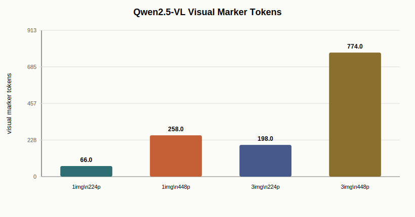

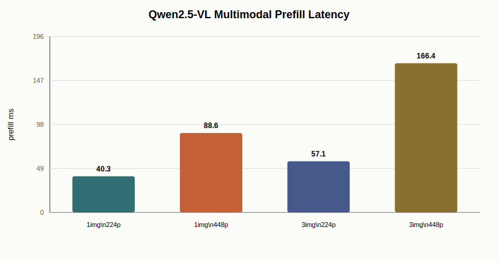

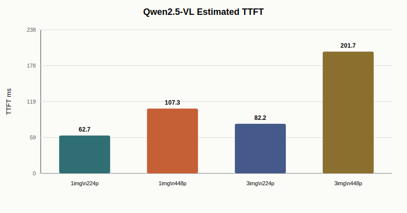


Main observation: adding cameras and increasing image resolution mostly hurts multimodal prefill and TTFT. The `3 images x 448` case produces 774 visual marker tokens and raises prefill to 166.4 ms, while GPU memory rises modestly from about 7.2 GiB to 7.6 GiB on this 3B VLM.

## Stage 2: Lightweight VLA Serving Prototype

To move beyond profiling, the project implements a small vLLM-style serving prototype for homogeneous VLA requests. It does not implement PagedAttention or a full async engine, but it does implement three concrete serving-infra mechanisms:

1. **Visual input cache.** Preprocessed image/text tensors are cached and reused for repeated visual-prefix requests, removing CPU image preprocessing and CPU-to-GPU transfer from the hot path.
2. **Shape-aware microbatching.** Requests with the same image count, image size, and decode length are batched into one Qwen2.5-VL `generate` call.
3. **KV cache memory accounting.** The benchmark estimates KV footprint from layer count, KV heads, head dimension, token count, batch size, and dtype.

The benchmark compares three scenarios for 8 requests with 3 camera images and `decode_len=32`:

| Input | Scenario | Requests/s | Latency/request | Speedup | Peak memory | Est. KV cache |
| --- | --- | ---: | ---: | ---: | ---: | ---: |
| 3x224 | cold serial | 1.58 | 637.3 ms | 1.00x | 7,212 MiB | 75.7 MiB |
| 3x224 | visual input cache, serial generate | 1.66 | 600.7 ms | 1.06x | 7,237 MiB | 75.7 MiB |
| 3x224 | visual input cache + microbatch | 8.82 | 113.47 ms | 5.62x | 7,515 MiB | 75.7 MiB |
| 3x448 | cold serial | 1.29 | 777.5 ms | 1.00x | 7,342 MiB | 237.7 MiB |
| 3x448 | visual input cache, serial generate | 1.40 | 711.8 ms | 1.09x | 7,440 MiB | 237.7 MiB |
| 3x448 | visual input cache + microbatch | 4.13 | 242.1 ms | 3.21x | 8,534 MiB | 237.7 MiB |

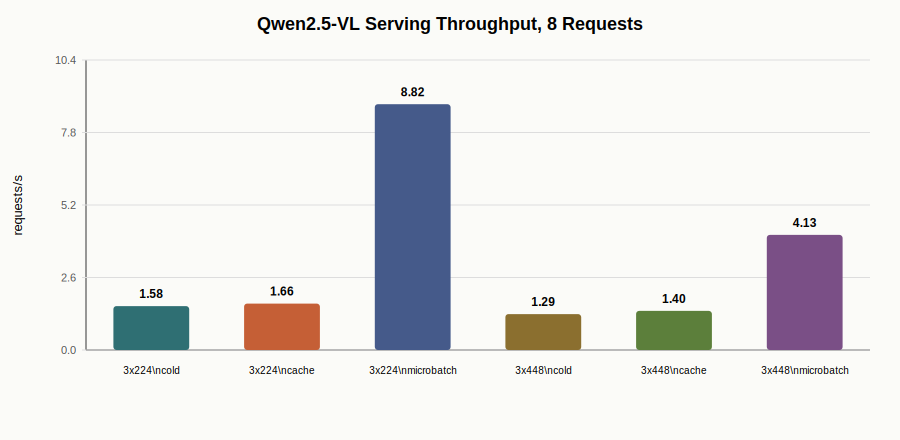

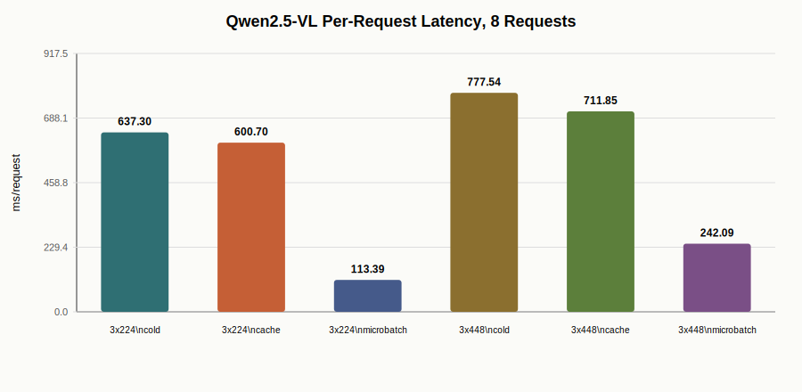

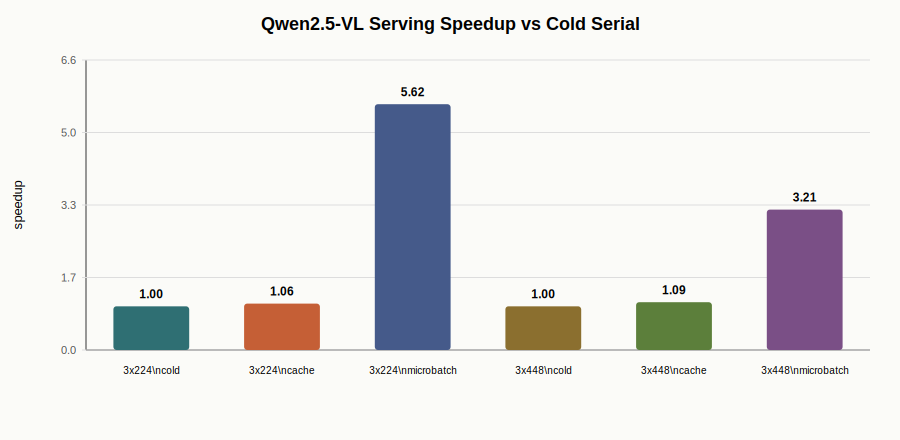

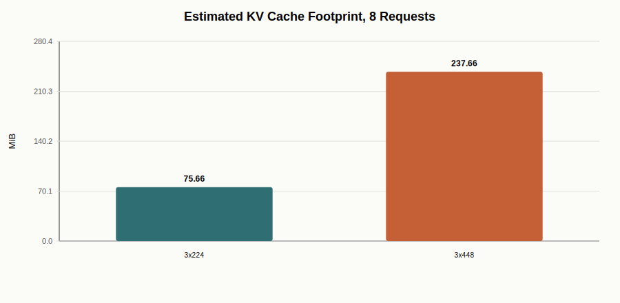

Main observation: visual input cache alone gives a modest 1.06-1.09x because generation dominates latency. The large win comes from batching same-shape VLA requests: 5.62x on `3x224` and 3.21x on `3x448`. The heavier visual prefix reduces batching gain and increases estimated KV footprint from 75.7 MiB to 237.7 MiB for 8 requests.

## Stage 3: Paged KV and Continuous Batching Simulator

The next stage adds a vLLM-style scheduler and memory-management simulator. It does not implement CUDA PagedAttention kernels, but it does implement the core serving concepts needed to reason about VLA workloads:

- paged KV block allocation with `block_size=16` tokens;
- append/free lifecycle during autoregressive decode;
- continuous batching over streaming requests;
- static full KV reservation vs paged append allocation;
- guarded paged admission to avoid decode-time block starvation;
- KV budget sweep under visual-token-heavy request mixes.

Default workload: 128 requests, mean arrival interval 90 ms, max active requests 16, 512 MiB KV budget. Request profiles are sampled from the measured Qwen2.5-VL visual-token CSV.

| Scenario | Throughput | Mean latency | P95 latency | Peak KV | Speedup |
| --- | ---: | ---: | ---: | ---: | ---: |
| serial no batch | 1.40 req/s | 40,901.6 ms | 78,171.5 ms | 30.9 MiB | 1.00x |
| continuous static KV | 10.44 req/s | 1,904.7 ms | 3,220.3 ms | 341.4 MiB | 7.45x |
| continuous paged KV | 10.44 req/s | 1,904.7 ms | 3,220.3 ms | 330.8 MiB | 7.45x |
| continuous paged KV guarded | 10.44 req/s | 1,904.7 ms | 3,220.3 ms | 330.8 MiB | 7.45x |

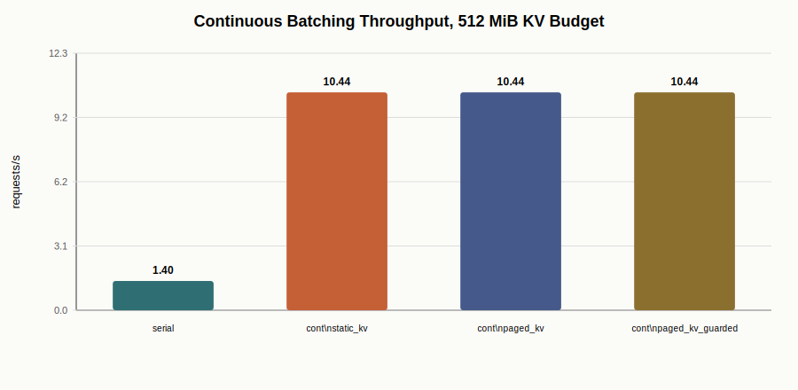

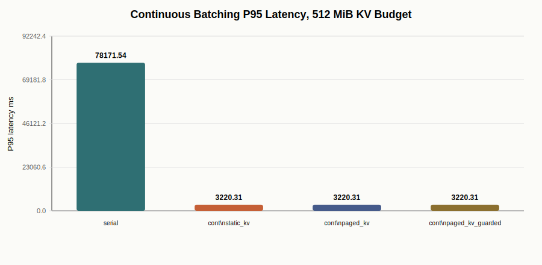

Under a tight 256 MiB KV budget, naive paged allocation over-admits prompt KV and later stalls during decode append. Adding a decode-block watermark recovers throughput from 7.42 req/s to 9.76 req/s. This is the main systems lesson: PagedAttention-style memory management must be paired with admission control and token-budget scheduling.

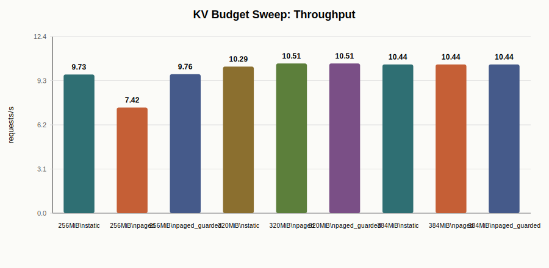

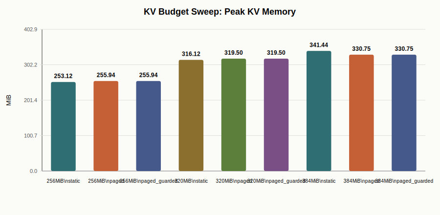

## Stage 4: Bucketed Scheduling and Prefix Cache Simulation

VLA requests have highly variable visual-token lengths. This stage compares FCFS batching, shape-aware batching, and token-budget batching using the measured Qwen2.5-VL token profiles. It also models repeated task/image prefixes with a prefix cache hit ratio. This is a simulator, not a claim that Qwen2.5-VL `past_key_values` are injected into model forward.

| Policy | Prefix cache | Throughput | P95 latency | Padding waste | Prefix hit rate |
| --- | ---: | ---: | ---: | ---: | ---: |
| FCFS | no | 4.56 req/s | 35,373.7 ms | 33.3% | 0.00 |
| FCFS | yes | 4.93 req/s | 31,566.1 ms | 33.3% | 0.88 |
| shape bucket | no | 6.01 req/s | 23,569.1 ms | 5.7% | 0.00 |
| shape bucket | yes | 6.45 req/s | 20,690.8 ms | 3.9% | 0.88 |
| token-budget bucket | no | 5.51 req/s | 28,050.6 ms | 9.5% | 0.00 |
| token-budget bucket | yes | 5.86 req/s | 26,042.7 ms | 12.0% | 0.88 |

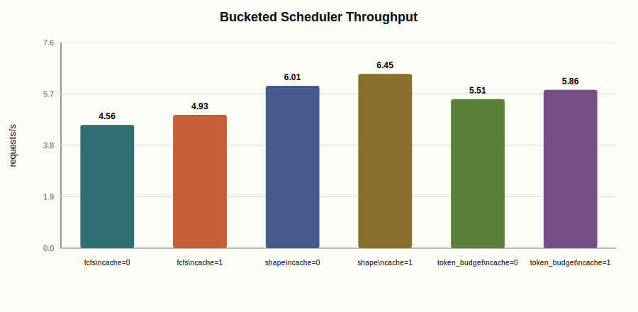

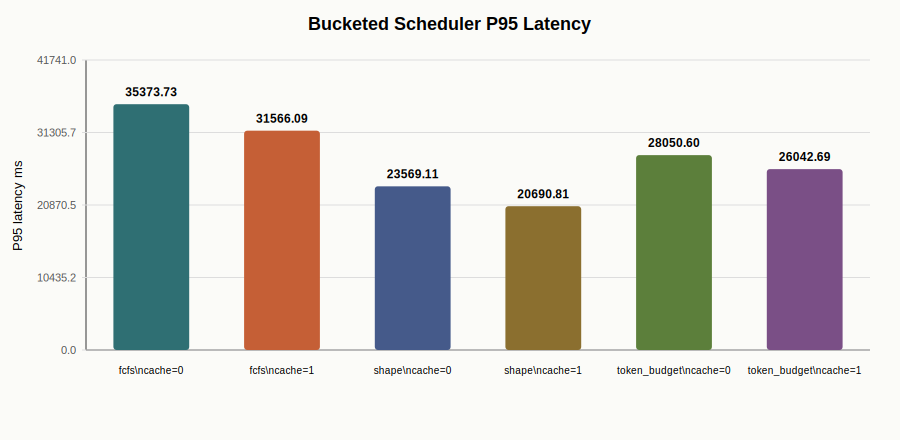

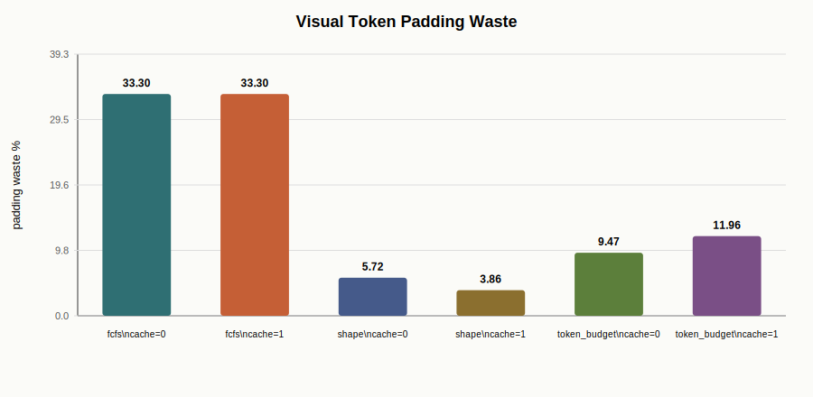

Main observation: shape-aware batching is the strongest policy in this synthetic VLA workload. It raises throughput from 4.56 to 6.01 req/s without prefix cache and cuts padding waste from 33.3% to 5.7%. Prefix cache helps, but it does not replace shape-aware scheduling.

## Stage 5: Qwen3 Language-Backbone Decode Subtest

The Qwen3-0.6B subtest isolates language decode behavior without image input. It is kept as a serving-infra control experiment for KV cache and attention backend behavior.

Selected SDPA baseline:

| Batch | Prompt | Decode | Prefill | Estimated TTFT | TPOT | Decode tokens/s | Max memory |
| ---: | ---: | ---: | ---: | ---: | ---: | ---: | ---: |
| 1 | 128 | 128 | 19.9 ms | 39.0 ms | 19.18 ms | 52.1 | 1,313 MiB |
| 2 | 128 | 128 | 19.2 ms | 38.1 ms | 18.82 ms | 106.3 | 1,481 MiB |
| 4 | 128 | 128 | 19.1 ms | 37.0 ms | 17.96 ms | 222.8 | 1,841 MiB |
| 4 | 1024 | 128 | 81.4 ms | 99.5 ms | 18.10 ms | 220.9 | 6,125 MiB |


KV cache comparison showed shape-dependent value: at `batch=4, prompt=512, decode=64`, cache reached 2.40x speedup, while small shapes could be slower than no-cache recompute.

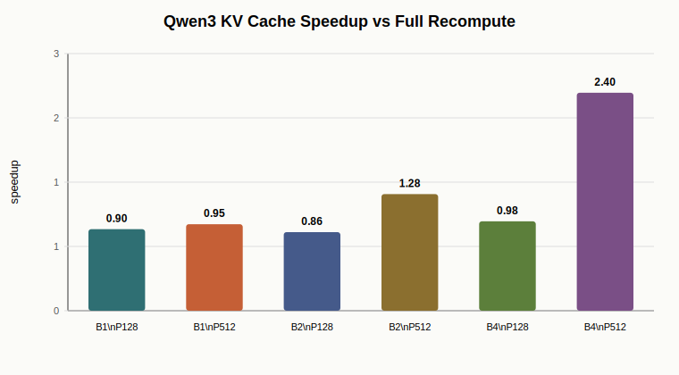

Attention backend comparison at `batch=4, prompt=1024, decode=128`:

| Backend | Prefill | TPOT | Decode tokens/s |
| --- | ---: | ---: | ---: |
| SDPA | 81.4 ms | 18.10 ms | 220.9 |
| eager | 178.6 ms | 18.49 ms | 216.3 |
| FlashAttention 2 | 92.8 ms | 29.60 ms | 135.1 |

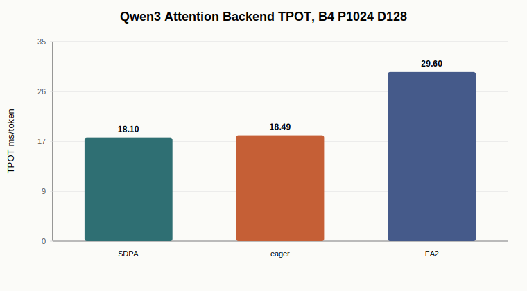

Main observation: the language-only subtest explains serving-side tradeoffs, but it is not by itself VLA. The Qwen2.5-VL stage above is what adds real visual tokens.

## Stage 6: VLA Action Post-processing with Triton

The action stage models a common VLA output path:

```text
hidden -> MLP action head -> action[B, horizon, action_dim]
action = pred * std + mean
action = clamp(action, low, high)
action = where(mask, action, previous_action)
```

The Triton kernel fuses denormalization, clamp, and mask select into one launch.

| Batch | Horizon | Action dim | Action head | PyTorch post | Triton post | Speedup |
| ---: | ---: | ---: | ---: | ---: | ---: | ---: |
| 1 | 10 | 14 | 0.031 ms | 29.87 us | 20.92 us | 1.43x |
| 4 | 10 | 14 | 0.032 ms | 47.95 us | 20.15 us | 2.38x |
| 16 | 32 | 14 | 0.035 ms | 29.83 us | 23.30 us | 1.28x |
| 64 | 10 | 64 | 0.035 ms | 189.74 us | 20.18 us | 9.40x |
| 256 | 10 | 64 | 0.036 ms | 289.76 us | 20.35 us | 14.24x |

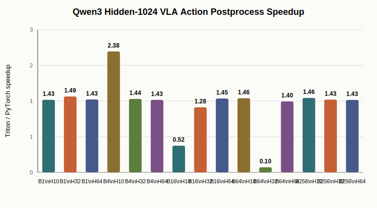

Main observation: the median speedup across tested shapes is 1.43x. Larger action tensors can benefit much more because PyTorch launches multiple elementwise kernels and materializes intermediates.


## Stage 7: Pi0.5 Real VLA Action Inference

Project 3 now includes a real VLA policy compute path with LeRobot Pi0.5. This stage loads `lerobot/pi05_libero_finetuned_v044` and runs the action inference path from camera tensors, language tokens, and robot state to a 50-step, 7-DoF action chunk. The benchmark uses synthetic observations and real PaliGemma-tokenized task text, so it is a systems benchmark of action inference latency rather than a robot-success claim.

| Benchmark | Result |
| --- | ---: |
| Action chunk shape | `(1, 50, 7)` |
| Warm full action chunk latency | 87.7 ms avg / 87.8 ms p50 |
| Amortized latency | 1.75 ms/action |
| `select_action` full model call | 92.8 ms avg |
| `select_action` queue pop | 3.47 ms avg / 3.49 ms p50 |
| Peak memory | 7.1-7.3 GiB |

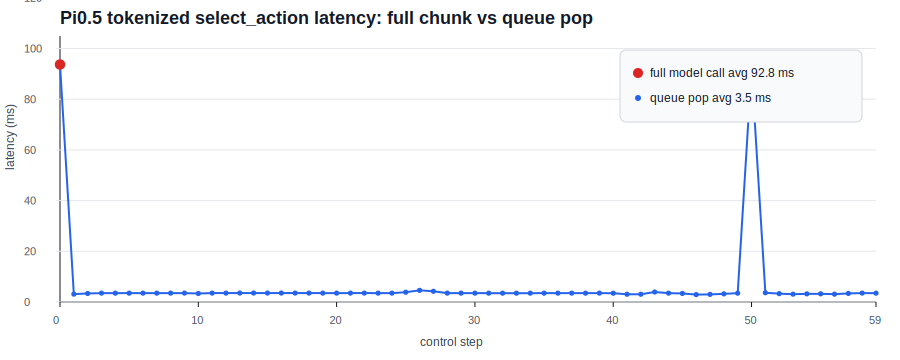

Key lesson: Pi0.5 is chunk-based. The model does not need to run for every control tick; `select_action` runs the full model when the action queue is empty and then serves subsequent actions from the queue. This makes cold-start warmup, action queue management, stale-action handling, and async control-loop scheduling central inference-infra concerns.

Using `PI05Policy`, the checkpoint matches 812/812 checkpoint tensors. `strict=False` is still used because the loader reports one missing tied/shared language embedding key, while all checkpoint tensors are shape-matched and loaded. Details are in [`project3_pi05_vla_action_inference.md`](project3_pi05_vla_action_inference.md).
## Stage 8: VLASH-Inspired Async Control Loop

The final layer connects measured Pi0.5 action latency to robot control-loop scheduling. It is inspired by VLASH's async VLA inference ideas, but implemented as a small independent simulator so the assumptions are transparent.

The simulator compares synchronous chunk execution, naive async action queue refill, future-state-aware async refill, and future-state async with action quantization ratio 2. It uses the measured Pi0.5 warm action-chunk latency of 87.7 ms, a 50-step action chunk, and a 30 Hz control loop.

| Scenario | Mean error | Reaction latency | Stall ratio | Mean state staleness | Control overhead |
| --- | ---: | ---: | ---: | ---: | ---: |
| sync chunk blocking | 0.054 | 0.0 ms | 5.8% | 895.6 ms | 1175.3 ms |
| async naive queue | 0.093 | 266.7 ms | 0.8% | 1045.9 ms | 1237.7 ms |
| async future-state queue | 0.075 | 166.7 ms | 0.8% | 945.9 ms | 1237.7 ms |
| async future-state quantized q2 | 0.074 | 166.7 ms | 0.8% | 945.9 ms | 618.9 ms |

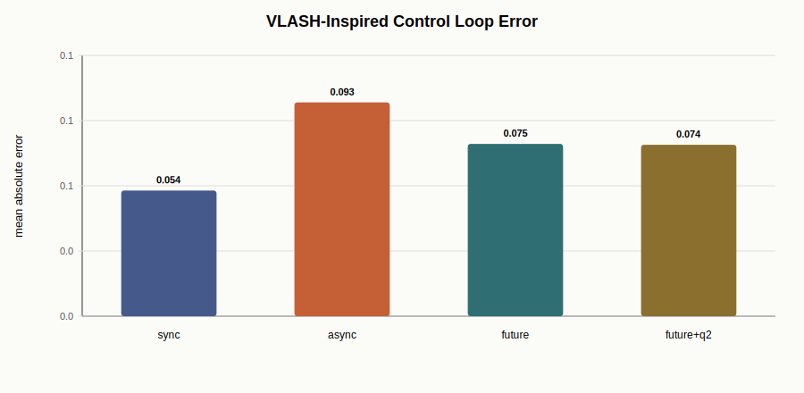

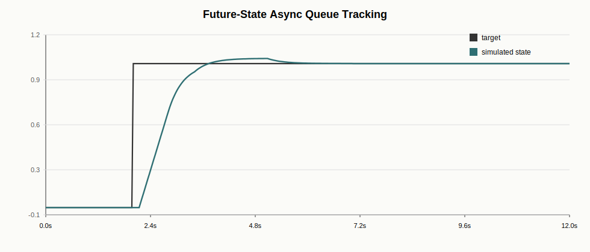

Main observation: the VLA serving problem is not only model throughput. Once a policy emits action chunks, queue refill timing, state staleness, and control-loop blocking become first-class inference-infra metrics. In this simulator, future-state refill keeps the low async stall ratio while reducing reaction latency from 266.7 ms to 166.7 ms. Action quantization ratio 2 halves modeled control-side action overhead in this setup.

Details are in [`project3_vlash_async_control_loop.md`](project3_vlash_async_control_loop.md).
## Integrated Interpretation

1. Real VLA-style inference must account for visual tokens. In this benchmark, moving from one 224 image to three 448 images increases visual marker tokens from 66 to 774 and prefill from 40.3 ms to 166.4 ms.
2. Multimodal prefill and language decode should be measured separately. Image count/resolution mostly shifts TTFT, while decode TPOT is dominated by the autoregressive language path.
3. Serving acceleration comes primarily from scheduler-level batching in this setup. Visual input cache helps modestly, while shape-aware microbatching improves 8-request throughput by 5.62x on `3x224` and 3.21x on `3x448`.
4. Continuous batching and paged KV management are coupled problems. In simulation, continuous batching improves throughput by 7.45x, while guarded paged admission avoids decode-time KV block starvation under tight memory budgets.
5. VLA batching should be visual-shape-aware. Shape buckets reduce padding waste from 33.3% to 5.7% and improve throughput from 4.56 to 6.01 req/s before prefix cache.
6. KV footprint grows with visual prefix length. Estimated KV cache for 8 measured requests rises from 75.7 MiB at `3x224` to 237.7 MiB at `3x448`, motivating paged KV/cache management in a production engine.
7. Action post-processing is small but real. Fusing action denorm/clamp/mask can reduce launch overhead, especially for batched control or simulation.
8. Real VLA serving needs control-loop metrics. Pi0.5 chunk inference is slower than a 30 Hz tick but faster than its action horizon, so async queue refill and future-state estimation are the important systems levers.

## Honest Boundaries

This project does not claim:

- a trained robot policy;
- full SmolVLA serving deployment;
- CUDA PagedAttention kernels or a production continuous-batching engine;
- a full VLASH implementation or real robot async deployment;
- policy quality improvement;
- fully validated Pi0.5 LIBERO policy quality, because the current run uses synthetic zero images/state and does not evaluate robot task success.

It does claim:

- real Qwen2.5-VL image-to-token multimodal inference profiling;
- Pi0.5 action chunk inference profiling with action queue latency and memory analysis;
- a VLASH-inspired async control-loop simulator grounded in measured Pi0.5 latency;
- visual-token / prefill / TTFT / memory analysis under single-camera and three-camera inputs;
- a lightweight serving prototype with visual input cache, same-shape microbatching, and KV footprint accounting;
- a paged KV / continuous batching simulator with block manager, budget sweep, and guarded admission;
- bucketed scheduling and prefix-cache simulation for visual-token-heavy VLA workloads;
- Qwen3 language decode sub-analysis for KV cache and attention backend tradeoffs;
- a working Triton fused action post-processing kernel tied to VLA action semantics.

## Resume-Worthy Claim

Built a Qwen2.5-VL/Qwen3-VL and Pi0.5 based VLM/VLA inference-infra lab, adding real image inputs, visual tokens, vLLM serving, visual input cache, same-shape microbatching, KV footprint accounting, paged-KV continuous batching simulation, shape-aware scheduling, Pi0.5 action-chunk profiling, and a VLASH-inspired async control-loop simulator. Measured image preprocessing, multimodal prefill, estimated TTFT, decode TPOT, visual-token count, GPU memory, action queue latency, and state-staleness metrics. Found visual marker tokens increase from 66 to 774 and prefill from 40.3 ms to 166.4 ms from `1x224` to `3x448`; Qwen3-VL vLLM reaches 10.08 req/s at concurrency 8 for 224px prompts; Pi0.5 emits `(1, 50, 7)` action chunks with 87.7 ms warm latency and 3.47 ms queue-pop latency. In simulations, continuous batching improves throughput by 7.45x, shape-aware scheduling improves throughput from 4.56 to 6.01 req/s, and future-state async refill reduces reaction latency from 266.7 ms to 166.7 ms under a 30 Hz control loop. Complemented this with a Triton fused action post-processing kernel with 1.43x median speedup and up to 14.24x on larger action tensors.
## Addendum: Qwen3-VL vLLM Serving Baseline

After the initial Qwen2.5-VL serving prototype, Project 3 added a real vLLM baseline with `Qwen/Qwen3-VL-4B-Instruct`. This strengthens the VLM serving layer of the project and separates it from the later Pi0.5 VLA action-inference layer.

The default vLLM path was validated on a 32 GiB AutoDL GPU with Python 3.12, PyTorch 2.8.0 + CUDA 12.8, and vLLM 0.24.0. At concurrency 8, it reached **10.08 req/s** for 224px single-image prompts and **8.73 req/s** for 448px prompts. Peak memory from `nvidia-smi` sampling was about **21.3 GiB**. Compared with the eager fallback, default vLLM improved concurrent throughput by 18-41% across most tested shapes while using similar peak memory.

Detailed results are in [`project3_qwen3vl_vllm_serving.md`](project3_qwen3vl_vllm_serving.md).

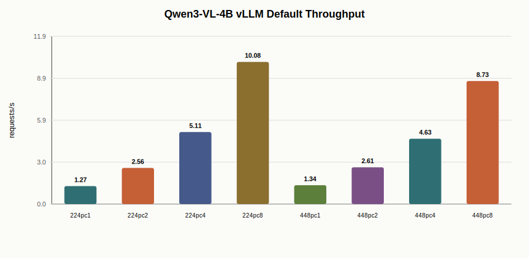

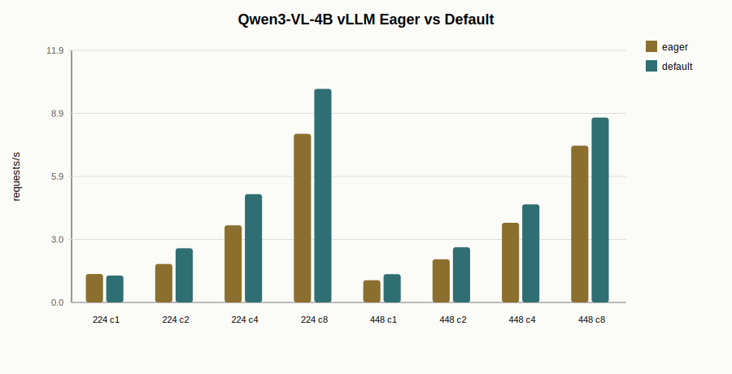
