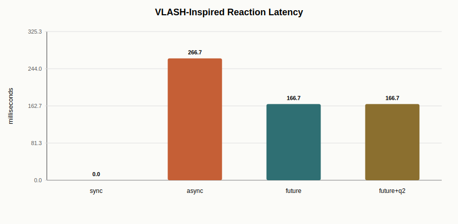
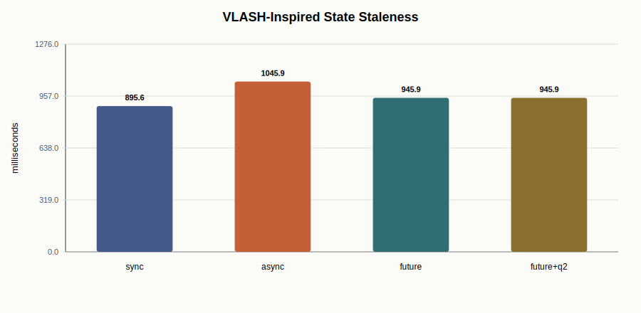

# Project 3 Addendum: VLASH-Inspired Async VLA Control Loop

Date: 2026-07-08

This addendum adds the third layer of Project 3: a control-loop serving simulator inspired by VLASH. It does not copy VLASH internals and does not claim a real robot deployment. It uses the measured Pi0.5 action latency from this project to study the systems problem that appears after model inference is fast enough to run in a robot loop:

```text
camera/state/task -> VLA policy -> action chunk -> action queue -> 30 Hz control loop
```

The key question is no longer just "how fast is one forward pass?" It is:

- can the policy generate the next action chunk before the current queue runs out?
- how stale is the observation used to generate queued actions?
- can future-state estimation reduce async-inference error?
- does action quantization reduce control-loop overhead without hurting stability too much?

## Why This Layer Exists

The Pi0.5 benchmark showed that the policy emits a 50-step action chunk:

| Metric | Value |
| --- | ---: |
| Action chunk | `(1, 50, 7)` |
| Warm chunk latency | 87.7 ms |
| Full `select_action` call | 92.8 ms |
| Queue pop | 3.47 ms |
| Peak memory | 7.1-7.3 GiB |

At 30 Hz, one control tick is 33.3 ms. A full Pi0.5 action-chunk inference is therefore slower than one tick, but much faster than the full 50-step action horizon. This is exactly where asynchronous inference and action queues become useful.

## Simulator Design

The simulator is intentionally small and readable:

- one-dimensional plant state;
- step target change at 2 seconds;
- 30 Hz control loop;
- Pi0.5 measured warm latency as policy latency;
- 50-step action chunk;
- action queue refill threshold;
- optional future-state prediction before generating the next chunk;
- optional action quantization ratio 2.

Scenarios:

| Scenario | Meaning |
| --- | --- |
| `sync_chunk_blocking` | Wait for policy inference, then execute a full chunk. Simple but blocks control. |
| `async_naive_queue` | Start inference while executing the current queue, but generate the next chunk from the stale current state. |
| `async_future_state_queue` | Start inference asynchronously and roll the state estimate forward to the expected inference completion time. |
| `async_future_state_quantized_q2` | Same as future-state async, but reuses each action for two ticks to model faster robot-side execution. |

## Results

| Scenario | Mean error | P95 error | Reaction latency | Stall ratio | Mean state staleness | Control overhead |
| --- | ---: | ---: | ---: | ---: | ---: | ---: |
| sync chunk blocking | 0.054 | 0.467 | 0.0 ms | 5.8% | 895.6 ms | 1175.3 ms |
| async naive queue | 0.093 | 0.733 | 266.7 ms | 0.8% | 1045.9 ms | 1237.7 ms |
| async future-state queue | 0.075 | 0.633 | 166.7 ms | 0.8% | 945.9 ms | 1237.7 ms |
| async future-state quantized q2 | 0.074 | 0.633 | 166.7 ms | 0.8% | 945.9 ms | 618.9 ms |







## Interpretation

Synchronous chunking is simple and accurate in this toy state model, but it blocks the control loop during policy inference. That is unacceptable for a real robot if sensor updates, safety checks, or low-level control must continue at a fixed frequency.

Naive async inference removes most blocking, but the generated action chunk is based on an older state. In this simulation, it increases reaction latency to 266.7 ms and raises mean tracking error.

Future-state async keeps the low stall ratio while reducing reaction latency from 266.7 ms to 166.7 ms and reducing mean error from 0.093 to 0.075. The mechanism is simple: when inference starts, the scheduler predicts where the robot will be when the chunk becomes available, then asks the policy for actions from that future state.

Action quantization with ratio 2 does not materially change this simple tracking error, but it halves the modeled robot-side control overhead from 1237.7 ms to 618.9 ms. In a real robot this would need a smoothness/safety check, because fewer distinct actions can reduce responsiveness.

## Relationship to VLASH

This layer is inspired by VLASH's public design goals: asynchronous inference, future-state-awareness, and action quantization for real-time VLA deployment. The current repository keeps a minimal independent simulator so the assumptions are easy to inspect and reproduce. If a later version directly imports or modifies VLASH code, it should keep the Apache-2.0 license notice and separate the third-party implementation from this project's own experiments.

## Honest Boundaries

This simulator does not prove robot task success. It does not simulate contact dynamics, camera latency, real policy quality, action normalization, safety limits, or low-level actuator constraints. It is a serving-infra experiment that connects measured Pi0.5 policy latency to control-loop scheduling decisions.

The useful claim is narrower and stronger: after measuring Pi0.5 action-chunk latency, the project models how async inference, future-state queue refill, and action quantization affect blocking, state staleness, reaction latency, and action-serving overhead.

