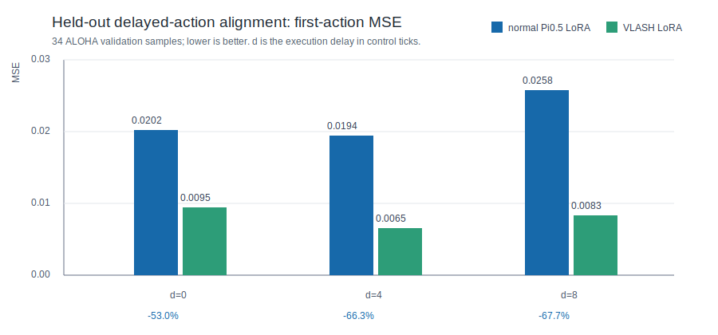

# VLASH 延迟鲁棒性对照实验

## 要回答的问题

当动作在观测之后 `d` 个控制 tick 才执行时，future-state-aware VLASH 微调能否让
Pi0.5 输出更接近该延迟时刻的真实动作，而不是输出已经过期的动作？

## 实验设计

数据集仍为 `lerobot/aloha_mobile_cabinet`，不引入外部数据。85 个 episode 以固定
seed 1000 做 episode 级划分：68 个用于训练，17 个从训练中完全排除并用于验证。具体
ID 见 [`episode_split.json`](episode_split.json)。

两个模型均从 `lerobot/pi05_base` 出发，使用相同 LoRA target modules、batch size 1、
学习率、优化器、随机 seed、5,000 optimizer steps 和 68 个训练 episode。配置来自
上游 VLASH `examples/train/pi05/async_lora.yaml`，仅有如下区别：

| 模型 | `max_delay_steps` | `shared_observation` | 训练语义 |
| --- | ---: | ---: | --- |
| Normal Pi0.5 LoRA | 0 | false | 当前 state / 当前动作块 |
| VLASH Pi0.5 LoRA | 8 | true | offset 0..8 的 future-state proxy / 延迟后动作块 |

评测使用上游 `SharedObservationVLASHDataset` 和 Pi0.5 `predict_action_chunk`。对每个
held-out 样本和延迟 `d`：

```text
Normal: state(t)            -> predict action chunk, compare with [a(t+d), ...]
VLASH: state proxy(t+d)     -> predict action chunk, compare with [a(t+d), ...]
```

其中 VLASH 默认的 state proxy 是记录轨迹中的 `a(t+d-1)`，与其训练分布一致。该测试
衡量的是离线动作对齐；不是实体机器人 rollout，也没有把记录动作代理替换为上一块的
模型预测动作。

## 主要结果



| 延迟 d | 指标 | Normal Pi0.5 | VLASH | 降低 |
| ---: | --- | ---: | ---: | ---: |
| 0 | 首动作 MSE | 0.02019 | 0.00950 | 53.0% |
| 4 | 首动作 MSE | 0.01943 | 0.00654 | 66.3% |
| 8 | 首动作 MSE | 0.02576 | 0.00831 | 67.7% |
| 8 | 前 4 步 MSE | 0.02798 | 0.00971 | 65.3% |
| 8 | 50 步 chunk MSE | 0.03929 | 0.02005 | 49.0% |

首动作 MSE 的配对 bootstrap 结果：

| 延迟 d | 有效配对数 | Normal - VLASH 的均值差 | 95% bootstrap 区间 |
| ---: | ---: | ---: | --- |
| 0 | 34 | 0.01069 | [0.00760, 0.01407] |
| 4 | 33 | 0.01289 | [0.00727, 0.02216] |
| 8 | 33 | 0.01745 | [0.00876, 0.02939] |

所有区间均大于零。更关键的是，首动作 MSE 的相对改善从 `d=0` 的 53.0% 增加到
`d=8` 的 67.7%，支持 VLASH 的延迟对齐训练在更大延迟下更有优势。

## 正确解读与边界

这是一组真实的 held-out episode 对照，不是模拟器数字；它证明在记录轨迹的 future-state
代理条件下，VLASH 模型更接近延迟时刻的真实动作块。

但不能把所有 `d=0` 改善都归因于 future-state：VLASH 的 shared-observation 每次更新
同时监督 9 个 offset，而普通模型每次更新监督 1 个 offset。因此它拥有更多 offset
监督信号。延迟收益的更强证据是：相对改善随 `d` 从 0 增至 8 而扩大，且 `d=8` 的配对
bootstrap 区间仍为正。

下一层验证应在真实机器人或控制仿真中使用上一块**预测**的末动作作为 proxy，并统计
action age、轨迹误差与任务成功率；这组离线实验不能替代该闭环评测。

## 可复核数据

- [`baseline_summary.csv`](baseline_summary.csv)
- [`vlash_summary.csv`](vlash_summary.csv)
- [`baseline_per_sample.csv`](baseline_per_sample.csv)
- [`vlash_per_sample.csv`](vlash_per_sample.csv)
- 训练配置：[`pi05_delay_ablation_sync.yaml`](pi05_delay_ablation_sync.yaml) 与
  [`pi05_delay_ablation_vlash.yaml`](pi05_delay_ablation_vlash.yaml)
