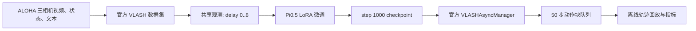
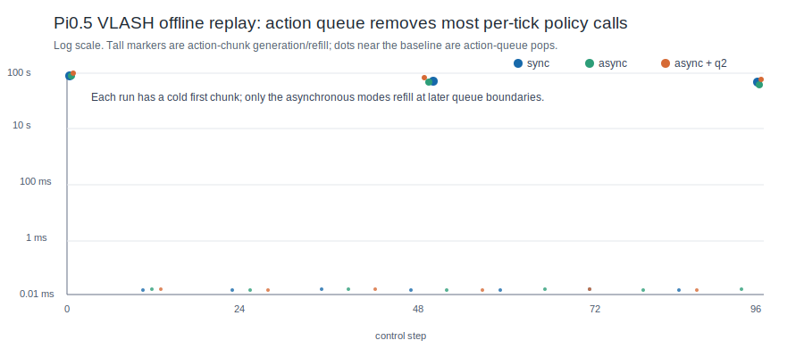
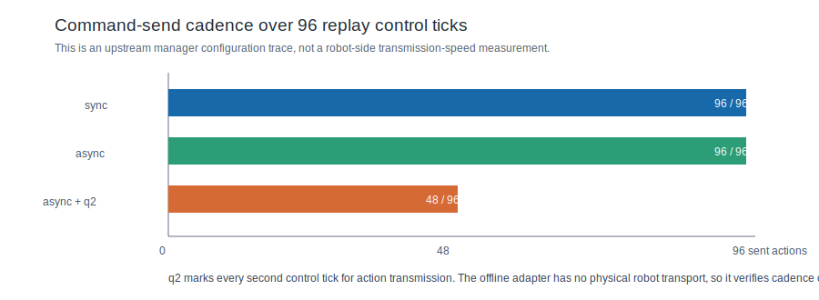

# VLASH Pi0.5 复现结果与推理分析

实验环境、计时范围与每张图的阅读方式见
[`experiment_protocol.md`](experiment_protocol.md)。

## 一句话结论

本实验完成了 VLASH 官方 Pi0.5 训练和策略级离线回放的完整链路：在真实
ALOHA 三相机轨迹上进行共享观测的 LoRA 微调，得到可加载的第 1,000 步
checkpoint；随后直接调用上游 `VLASHAsyncManager` 验证动作块队列、未来状态
调度和量化发送节奏。**它证明了软件链路可运行，但不把离线回放的均值延迟误写成
实体机器人端的加速。**

## 1. 复现了什么

除本地 tokenizer 路径兼容补丁外，训练、共享观测、未来状态、动作量化和
调度器均沿用 [VLASH](https://github.com/mit-han-lab/vlash) 上游实现；补丁说明见
[`../../vlash_reproduction/docs/local_compatibility.md`](../../vlash_reproduction/docs/local_compatibility.md)。

| 项目 | 本次设置 |
| --- | --- |
| 数据 | `lerobot/aloha_mobile_cabinet`，85 个 episode、127,500 帧、3 路相机 |
| 模型 | Pi0.5，3.77B 总参数；154M 可训练 LoRA 参数 |
| 训练 | 单张 32 GiB vGPU，1,000 step，batch size 1 |
| 延迟训练 | `max_delay_steps=8`，共享观测开启，覆盖 offset 0..8 |
| 产物 | step 1,000 checkpoint；策略 7.48 GiB，优化器 1.09 GiB |

这里的“共享观测”不是随机抽一个延迟。上游数据集会为同一观测构造 0 到 8 的
全部延迟分支，再复用视觉和语言观测编码；因此它对应的正是 VLASH 的
shared-observation 训练路径。默认 future state 使用上一时刻动作作为代理，而非
直接读取未来真值状态。

## 2. 微调是否正常

| 指标 | 结果 | 含义 |
| --- | ---: | --- |
| step 20 loss | 0.413 | 刚开始适配数据分布 |
| step 200 loss | 0.101 | 损失快速下降 |
| step 600 loss | 0.062 | 进入稳定下降区间 |
| step 1,000 loss | 0.059 | 训练未发散，checkpoint 正常落盘 |
| 稳态单步更新 | 0.63-0.78 s | 主导时间来自模型前反向传播 |
| 稳态数据时间 | 约 1 ms | worker/cache 使数据准备不再是该轮训练的主瓶颈 |

这说明训练链路、LoRA 梯度、数据解码与 checkpoint 都已跑通。不过 1,000 step
只覆盖了完整数据集的一小部分采样，**loss 下降不等价于机器人任务成功率**；要评价
控制质量仍需要更长训练和 LIBERO/实体机器人 rollout 成功率。

## 3. 推理时到底发生了什么

Pi0.5 一次模型调用产生 `(1, 50, 7)` 的动作块：50 个连续控制动作、每个动作 7 维。
因此控制循环里的绝大多数 tick 不需要重新跑 3.77B 参数模型，只需从队列取下一个
动作；队列用完时才产生一次高成本的动作块生成或重填。

图使用对数坐标，否则约 0.05 ms 的队列操作会被几十秒级的动作块调用完全压扁。
首个动作块包含冷启动、权重/算子初始化等一次性成本；它不能拿来代表稳态控制 tick。

| 96 个回放 tick 的实测值 | 同步 | VLASH 异步 | 异步 + 量化比 2 |
| --- | ---: | ---: | ---: |
| 动作块调用次数 | 2 | 3 | 3 |
| 普通队列取动作次数 | 94 | 93 | 93 |
| 队列取动作中位数 | 0.048 ms | 0.045 ms | 0.046 ms |
| observation 刷新次数 | 2 | 2 | 3 |
| 记录为“发送动作”的次数 | 96 | 96 | 48 |
| `get_action` 均值 | 1,803.0 ms | 1,821.1 ms | 2,815.4 ms |

原始记录可复查：[`replay_summary.csv`](replay_summary.csv)、
[`final_replay_vlash_sync_96.csv`](final_replay_vlash_sync_96.csv)、
[`final_replay_vlash_async_96.csv`](final_replay_vlash_async_96.csv)、
[`final_replay_vlash_async_quant2_96.csv`](final_replay_vlash_async_quant2_96.csv)。

### 为什么异步模式的均值没有更低

这个现象是本次复现最重要的结论，而不是失败。

1. 上游 `VLASHAsyncManager` 在当前公开实现中仍在 `get_action()` 内同步启动策略
   前向；它改变的是何时预取/用未来状态重填动作块，不是另起 CUDA stream 把完整前向
   与机器人通信真正并行。
2. 离线 adapter 没有实体机器人、网络传输、执行器 `send_action()` 和 30 Hz 真实时钟。
   因此不存在可以与策略前向重叠的 I/O 空档。
3. 均值被 2-3 次几十秒级的动作块调用支配；把 93-94 次约 0.05 ms 队列操作平均进去，
   仍无法代表控制 tick 的常态。

因此，离线实验能严谨证明“动作块队列和未来状态路径工作了”，不能严谨声称
“async 比 sync 的端到端推理更快”。硬件测试应统计控制 tick stall、动作年龄、命令
传输时间和 rollout 成功率。

## 4. 动作量化在本次实验中验证了什么

量化比为 2 时，上游管理器将 96 个控制 tick 中的 48 个标为发送动作，正好是每两个
tick 一次。这验证了量化配置和控制侧发送节奏。但当前 replay 的 `send_action` 是记录
标记而不是真实串口/网络指令，所以它**不能**直接推出“传输耗时降低 50%”。这个 50%
只是在真实机器人存在固定每命令开销时应当进一步测量的假设。

## 5. 可写入项目结论

- 完整复现了上游 VLASH 的 Pi0.5 LoRA、共享观测延迟训练、未来状态代理和异步动作
  队列路径，并在真实 ALOHA 多相机数据上产出可重放 checkpoint。
- 定位“模型块生成”和“控制 tick”是两类完全不同的时延：前者是高成本模型前向，后者
  在动作块有效期内为约 0.05 ms 的队列操作。
- 明确当前离线条件的边界：它验证软件正确性与调度行为，但不以缺少机器人 I/O 的均值
  延迟冒充实体系统加速。下一步应接入真实/仿真控制环境，以 tick stall、action age、
  命令耗时和任务成功率做同步/异步/量化消融。
