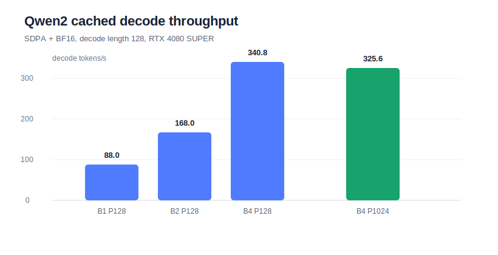
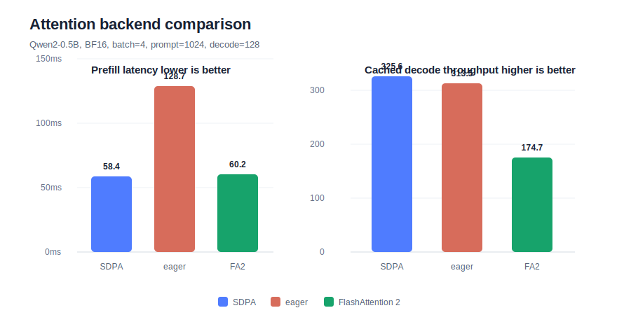
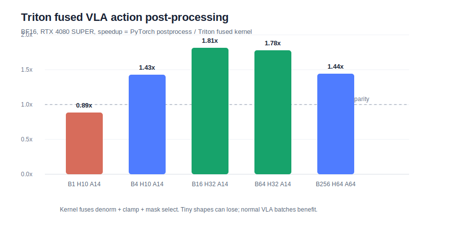

# Project 3 Final Report: Qwen2-Based VLA Inference Acceleration Lab

Date: 2026-07-08

Project 3 builds a compact VLA-style inference acceleration lab around Qwen2-0.5B. It borrows the metric discipline of modern LLM serving systems such as vLLM: separate prefill from decode, measure estimated TTFT and TPOT, inspect KV-cache behavior, compare attention backends by phase, and then add a VLA-specific action-output kernel.

The project is intentionally not a full vLLM fork and not a complete SmolVLA serving engine. It is a controlled inference-infra lab that makes bottlenecks and tradeoffs visible on one RTX 4080 SUPER.

## Completed Scope

| Area | Completed work |
| --- | --- |
| Baseline inference | Qwen2-0.5B BF16 prefill/decode benchmark with PyTorch SDPA |
| Serving metrics | prefill latency, decode latency, estimated TTFT, TPOT, decode tokens/s, max GPU memory |
| KV cache | cached decode vs full-prefix recompute across batch/prompt/decode shapes |
| Attention backend | SDPA vs eager vs FlashAttention 2 under selected prefill/decode shapes |
| VLA action path | simplified Qwen2-style hidden state to action chunk head |
| Triton kernel | fused action denormalization + clamp + mask select |
| Reporting | raw CSVs, stage reports, SVG figures, final summary, resume bullets |

## Environment

| Item | Value |
| --- | --- |
| GPU | NVIDIA GeForce RTX 4080 SUPER, 32 GiB |
| Python | 3.12.3 |
| PyTorch | 2.8.0+cu128 |
| CUDA runtime | 12.8 |
| flash-attn | 2.8.3 |
| Model | `Qwen/Qwen2-0.5B-Instruct` |
| dtype | BF16 |
| Model source | ModelScope cache |

## Stage 1: Prefill / Decode Baseline

The first stage measures Qwen2 inference with PyTorch SDPA and Hugging Face `past_key_values`.

| Batch | Prompt | Decode | Prefill | Estimated TTFT | TPOT | Decode tokens/s | Max memory |
| ---: | ---: | ---: | ---: | ---: | ---: | ---: | ---: |
| 1 | 128 | 128 | 11.0 ms | 22.4 ms | 11.37 ms | 88.0 | 1,071 MiB |
| 2 | 128 | 128 | 11.4 ms | 23.3 ms | 11.91 ms | 168.0 | 1,186 MiB |
| 4 | 128 | 128 | 12.2 ms | 24.0 ms | 11.74 ms | 340.8 | 1,421 MiB |
| 4 | 1024 | 128 | 58.4 ms | 70.7 ms | 12.28 ms | 325.6 | 4,696 MiB |



Main lesson: cached decode TPOT is fairly stable around 11-12 ms/token, while longer prompts mainly hurt prefill latency and KV-cache memory.

## Stage 2: KV Cache vs No-Cache Decode

The second stage compares cached decode with full-prefix recompute. The result is intentionally nuanced: KV cache is not free.

| Batch | Prompt | Decode | Cached TPOT | No-cache TPOT | Cache speedup |
| ---: | ---: | ---: | ---: | ---: | ---: |
| 1 | 128 | 64 | 12.73 ms | 10.76 ms | 0.85x |
| 1 | 512 | 64 | 11.77 ms | 11.22 ms | 0.95x |
| 2 | 512 | 64 | 12.34 ms | 17.18 ms | 1.39x |
| 4 | 128 | 64 | 11.96 ms | 11.58 ms | 0.97x |
| 4 | 512 | 64 | 12.09 ms | 30.84 ms | 2.55x |


Main lesson: cache overhead can dominate small shapes, but cache becomes clearly valuable when prompt length and batch size make recomputation expensive. This is the practical motivation for KV-cache layout, batching policy, and scheduler design in serving systems.

## Stage 3: Attention Backend Comparison

The third stage compares SDPA, eager attention, and FlashAttention 2 under selected shapes.

For `batch=4`, `prompt_len=1024`, `decode_len=128`:

| Backend | Prefill | TPOT | Decode tokens/s |
| --- | ---: | ---: | ---: |
| SDPA | 58.4 ms | 12.28 ms | 325.6 |
| eager | 128.7 ms | 12.76 ms | 313.5 |
| FlashAttention 2 | 60.2 ms | 22.90 ms | 174.7 |



Main lesson: fused attention helps long-prefill shapes relative to eager, but the best backend for one-token cached decode may differ. On this Qwen2/Hugging Face path, SDPA is the best default; FlashAttention 2 matches SDPA on long prefill but underperforms on cached decode.

## Stage 4: VLA Action Head and Triton Fused Kernel

The final stage attaches a simplified action-output path to a Qwen2-style hidden state:

```text
hidden[B, 896] -> MLP action head -> action[B, horizon, action_dim]
```

Then it fuses common VLA action post-processing in Triton:

```text
action = pred * std + mean
action = clamp(action, low, high)
action = where(mask, action, previous_action)
```

| Batch | Horizon | Action dim | Elements | Action head | PyTorch post | Triton post | Speedup |
| ---: | ---: | ---: | ---: | ---: | ---: | ---: | ---: |
| 1 | 10 | 14 | 140 | 0.030 ms | 30.37 us | 34.18 us | 0.89x |
| 4 | 10 | 14 | 560 | 0.036 ms | 30.88 us | 21.54 us | 1.43x |
| 16 | 32 | 14 | 7,168 | 0.039 ms | 37.38 us | 20.60 us | 1.81x |
| 64 | 32 | 14 | 28,672 | 0.040 ms | 36.92 us | 20.71 us | 1.78x |
| 256 | 64 | 64 | 1,048,576 | 0.068 ms | 30.66 us | 21.28 us | 1.44x |



Main lesson: action post-processing is tiny, so the win is mostly from reducing launch and intermediate tensor overhead. Triton averages 1.44x and peaks at 1.81x, but very small shapes can lose.

## Integrated Interpretation

The four stages give a coherent inference-infra picture:

1. **Separate prefill from decode.** Prompt/context work and token/action generation have different bottlenecks.
2. **KV cache has shape-dependent value.** It is essential for longer contexts and batched serving, but not automatically faster for tiny shapes in a small model.
3. **Attention backend choice is phase-specific.** SDPA, eager, and FlashAttention 2 behave differently across long prefill and one-token decode.
4. **VLA action outputs deserve their own kernels.** Even small post-processing ops can matter in high-frequency control or batched environments, but fusion must be benchmarked across shapes.

This complements the first two portfolio projects: Project 1 covers distributed MoE training, Project 2 covers VLA data/fine-tuning infrastructure, and Project 3 covers VLA-style inference profiling and kernel optimization.

## Honest Boundaries

This project does not claim:

- a production vLLM-compatible engine;
- PagedAttention implementation;
- full SmolVLA serving deployment;
- robot policy quality improvements.

It does claim:

- reproducible Qwen2-based inference profiling;
- vLLM-style TTFT/TPOT/KV-cache analysis;
- attention backend benchmarking with real measurements;
- a working Triton fused action post-processing kernel tied to VLA output semantics.

## Resume-Worthy Claim

Built a Qwen2-based VLA inference acceleration lab on RTX 4080 SUPER, measuring prefill/decode latency, estimated TTFT, TPOT, KV-cache behavior, attention backend differences, and action-output post-processing. Found KV cache speedups up to 2.55x only for larger prompt/batch shapes, showed SDPA outperforming eager and FlashAttention 2 on this Hugging Face cached-decode path, and implemented a Triton fused action post-processing kernel with 1.44x average speedup and up to 1.81x over PyTorch elementwise ops.
