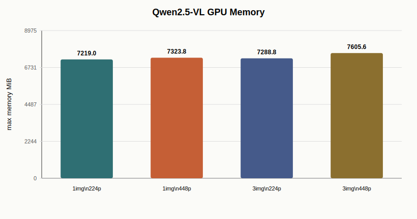
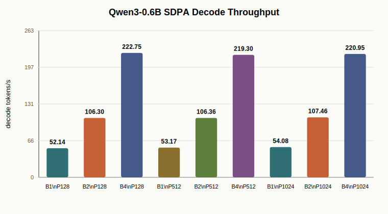

# Project 3 Final Report: VLM/VLA-Style Inference Profiling and Triton Kernel

Date: 2026-07-08

Project 3 now uses `Qwen/Qwen2.5-VL-3B-Instruct` to add real image input and visual tokens to the inference path. The earlier `Qwen/Qwen3-0.6B` benchmark is retained as a language-backbone decode sub-experiment, but the main VLA-style claim is now grounded in a VLM path:

```text
camera image(s) -> Qwen2.5-VL processor -> visual tokens + task text -> multimodal prefill -> decode -> action post-processing
```

The project is not a full robot policy and does not claim real control quality. It is an inference-infrastructure lab for measuring multimodal prefill, visual-token cost, cached generation behavior, attention backend choices, GPU memory, and VLA-style action post-processing.

## Completed Scope

| Area | Completed work |
| --- | --- |
| VLM backbone | Qwen2.5-VL-3B-Instruct BF16 multimodal inference benchmark |
| Visual input | synthetic single-camera and three-camera image inputs |
| Visual-token profiling | image count / image size / pixel budget vs input tokens, prefill latency, TTFT, memory |
| Language decode subtest | Qwen3-0.6B prefill/decode, KV-cache, attention backend comparison |
| VLA action path | simplified hidden-state-to-action head |
| Triton kernel | fused action denormalization, clamp, and mask select |
| Reporting | raw CSVs, SVG figures, final summary, resume bullets |

## Environment

| Item | Value |
| --- | --- |
| GPU | NVIDIA GeForce RTX 4080 SUPER, 32 GiB |
| Python | 3.12.3 |
| PyTorch | 2.8.0+cu128 |
| CUDA runtime | 12.8 |
| flash-attn | 2.8.3 |
| VLM model | `Qwen/Qwen2.5-VL-3B-Instruct` |
| Language subtest model | `Qwen/Qwen3-0.6B` |
| dtype | BF16 |
| Model source | ModelScope cache |

## Stage 1: Qwen2.5-VL Visual Token Profiling

The benchmark generates synthetic camera images and sends them through the real Qwen2.5-VL processor/model path. For this stage, `prefill_ms` is measured with a direct forward pass. `decode_ms` is estimated from `model.generate(max_new_tokens=N) - prefill_ms`, because Qwen2.5-VL generation uses model-specific multimodal cache/RoPE state that should not be replaced by the pure CausalLM decode loop.

Dynamic pixel budget:

```text
min_pixels = 4 * 28 * 28 = 3,136
max_pixels = 1024 * 28 * 28 = 802,816
```

Selected results with `decode_len=64`:

| Images | Size | Input tokens | Visual marker tokens | Preprocess | Prefill | Estimated TTFT | TPOT | Max memory |
| ---: | ---: | ---: | ---: | ---: | ---: | ---: | ---: | ---: |
| 1 | 224 | 105 | 66 | 4.2 ms | 40.3 ms | 62.7 ms | 17.76 ms | 7,219 MiB |
| 3 | 224 | 237 | 198 | 6.7 ms | 57.1 ms | 82.2 ms | 17.78 ms | 7,289 MiB |
| 1 | 448 | 297 | 258 | 7.1 ms | 88.6 ms | 107.3 ms | 10.60 ms | 7,324 MiB |
| 3 | 448 | 813 | 774 | 13.9 ms | 166.4 ms | 201.7 ms | 18.36 ms | 7,606 MiB |




Main observation: adding cameras and increasing image resolution mostly hurts multimodal prefill and TTFT. The `3 images x 448` case produces 774 visual marker tokens and raises prefill to 166.4 ms, while GPU memory rises modestly from about 7.2 GiB to 7.6 GiB on this 3B VLM.

## Stage 2: Qwen3 Language-Backbone Decode Subtest

The Qwen3-0.6B subtest isolates language decode behavior without image input. It is kept as a serving-infra control experiment for KV cache and attention backend behavior.

Selected SDPA baseline:

| Batch | Prompt | Decode | Prefill | Estimated TTFT | TPOT | Decode tokens/s | Max memory |
| ---: | ---: | ---: | ---: | ---: | ---: | ---: | ---: |
| 1 | 128 | 128 | 19.9 ms | 39.0 ms | 19.18 ms | 52.1 | 1,313 MiB |
| 2 | 128 | 128 | 19.2 ms | 38.1 ms | 18.82 ms | 106.3 | 1,481 MiB |
| 4 | 128 | 128 | 19.1 ms | 37.0 ms | 17.96 ms | 222.8 | 1,841 MiB |
| 4 | 1024 | 128 | 81.4 ms | 99.5 ms | 18.10 ms | 220.9 | 6,125 MiB |



KV cache comparison showed shape-dependent value: at `batch=4, prompt=512, decode=64`, cache reached 2.40x speedup, while small shapes could be slower than no-cache recompute.


Attention backend comparison at `batch=4, prompt=1024, decode=128`:

| Backend | Prefill | TPOT | Decode tokens/s |
| --- | ---: | ---: | ---: |
| SDPA | 81.4 ms | 18.10 ms | 220.9 |
| eager | 178.6 ms | 18.49 ms | 216.3 |
| FlashAttention 2 | 85.0 ms | 29.60 ms | 135.1 |


Main observation: the language-only subtest explains serving-side tradeoffs, but it is not by itself VLA. The Qwen2.5-VL stage above is what adds real visual tokens.

## Stage 3: VLA Action Post-processing with Triton

The action stage models a common VLA output path:

```text
hidden -> MLP action head -> action[B, horizon, action_dim]
action = pred * std + mean
action = clamp(action, low, high)
action = where(mask, action, previous_action)
```

The Triton kernel fuses denormalization, clamp, and mask select into one launch.

| Batch | Horizon | Action dim | Action head | PyTorch post | Triton post | Speedup |
| ---: | ---: | ---: | ---: | ---: | ---: | ---: |
| 1 | 10 | 14 | 0.031 ms | 29.87 us | 20.92 us | 1.43x |
| 4 | 10 | 14 | 0.032 ms | 47.95 us | 20.15 us | 2.38x |
| 16 | 32 | 14 | 0.035 ms | 29.83 us | 23.30 us | 1.28x |
| 64 | 10 | 64 | 0.035 ms | 189.74 us | 20.18 us | 9.40x |
| 256 | 10 | 64 | 0.036 ms | 289.76 us | 20.35 us | 14.24x |


Main observation: the median speedup across tested shapes is 1.43x. Larger action tensors can benefit much more because PyTorch launches multiple elementwise kernels and materializes intermediates.

## Integrated Interpretation

1. Real VLA-style inference must account for visual tokens. In this benchmark, moving from one 224 image to three 448 images increases visual marker tokens from 66 to 774 and prefill from 40.3 ms to 166.4 ms.
2. Multimodal prefill and language decode should be measured separately. Image count/resolution mostly shifts TTFT, while decode TPOT is dominated by the autoregressive language path.
3. KV cache and attention backend behavior remains shape-dependent. Language-only Qwen3 isolates those serving tradeoffs, but the VLM benchmark is needed to understand visual prefix cost.
4. Action post-processing is small but real. Fusing action denorm/clamp/mask can reduce launch overhead, especially for batched control or simulation.

## Honest Boundaries

This project does not claim:

- a trained robot policy;
- full SmolVLA serving deployment;
- PagedAttention or continuous batching;
- policy quality improvement.

It does claim:

- real Qwen2.5-VL image-to-token multimodal inference profiling;
- visual-token / prefill / TTFT / memory analysis under single-camera and three-camera inputs;
- Qwen3 language decode sub-analysis for KV cache and attention backend tradeoffs;
- a working Triton fused action post-processing kernel tied to VLA action semantics.

## Resume-Worthy Claim

Built a Qwen2.5-VL-3B based VLA-style inference profiling lab on RTX 4080 SUPER, adding real image inputs and visual tokens to the inference path. Measured image preprocessing, multimodal prefill, estimated TTFT, decode TPOT, visual-token count, and GPU memory under single-camera and three-camera inputs; found visual marker tokens increase from 66 to 774 and prefill from 40.3 ms to 166.4 ms from `1x224` to `3x448`. Complemented this with Qwen3 language-backbone KV-cache/attention-backend profiling and implemented a Triton fused action post-processing kernel with 1.43x median speedup and up to 14.24x on larger action tensors.
