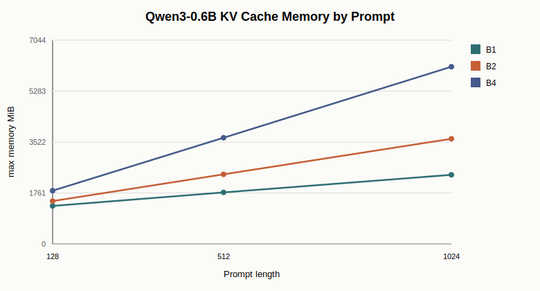

# Project 3 Final Report: Qwen3-Based VLA Inference Profiling and Triton Kernel

Date: 2026-07-08

Project 3 builds a compact VLA-style inference profiling lab around `Qwen/Qwen3-0.6B`. The goal is not to fork vLLM or claim a production serving engine. The goal is to make the serving path measurable: split prefill and decode, report TTFT/TPOT/tokens/s/memory, compare KV-cache behavior, inspect attention backend choices, and add one VLA-specific fused action post-processing kernel.

This project complements the first two portfolio modules: Project 1 studies distributed MoE training, Project 2 studies VLA data and fine-tuning infrastructure, and Project 3 studies inference-side latency and kernel tradeoffs.

## Completed Scope

| Area | Completed work |
| --- | --- |
| Language backbone | Qwen3-0.6B BF16 inference benchmark |
| Serving metrics | prefill latency, estimated TTFT, TPOT, decode tokens/s, max GPU memory |
| KV cache | cached decode vs full-prefix recompute across batch/prompt/decode shapes |
| Attention backend | SDPA vs eager vs FlashAttention 2 on selected prefill/decode shapes |
| VLA action path | simplified hidden-state-to-action head with Qwen3 hidden size 1024 |
| Triton kernel | fused action denormalization, clamp, and mask select |
| Reporting | raw CSVs, SVG figures, final summary, resume bullets |

## Environment

| Item | Value |
| --- | --- |
| GPU | NVIDIA GeForce RTX 4080 SUPER, 32 GiB |
| Python | 3.12.3 |
| PyTorch | 2.8.0+cu128 |
| CUDA runtime | 12.8 |
| flash-attn | 2.8.3 |
| Model | `Qwen/Qwen3-0.6B` |
| dtype | BF16 |
| Model source | ModelScope cache |

## Stage 1: Prefill / Decode Baseline

The baseline uses Hugging Face generation primitives with PyTorch SDPA and `past_key_values`. The benchmark separates prompt prefill from autoregressive decode.

| Batch | Prompt | Decode | Prefill | Estimated TTFT | TPOT | Decode tokens/s | Max memory |
| ---: | ---: | ---: | ---: | ---: | ---: | ---: | ---: |
| 1 | 128 | 128 | 19.9 ms | 39.0 ms | 19.18 ms | 52.1 | 1,313 MiB |
| 2 | 128 | 128 | 19.2 ms | 38.1 ms | 18.82 ms | 106.3 | 1,481 MiB |
| 4 | 128 | 128 | 19.1 ms | 37.0 ms | 17.96 ms | 222.8 | 1,841 MiB |
| 4 | 512 | 128 | 38.6 ms | 56.8 ms | 18.24 ms | 219.3 | 3,672 MiB |
| 4 | 1024 | 128 | 81.4 ms | 99.5 ms | 18.10 ms | 220.9 | 6,125 MiB |




Main observation: decode TPOT stays around 18-19 ms/token for these shapes, while longer prompts mainly increase prefill latency and KV-cache memory. At `batch=4, prompt=1024, decode=128`, max memory is about 6.1 GiB, leaving substantial room on a 32 GiB 4080 SUPER for larger batch or longer context experiments.

## Stage 2: KV Cache vs Full Recompute

The KV-cache result is intentionally not a blanket speedup claim. For small shapes, cache bookkeeping can cost more than recomputing the short prefix. It becomes useful when batch size and prompt length make full-prefix recompute expensive.

| Batch | Prompt | Decode | Cached TPOT | No-cache TPOT | Cache speedup |
| ---: | ---: | ---: | ---: | ---: | ---: |
| 1 | 128 | 64 | 17.25 ms | 15.46 ms | 0.90x |
| 1 | 512 | 64 | 17.35 ms | 16.51 ms | 0.95x |
| 2 | 512 | 64 | 17.57 ms | 22.51 ms | 1.28x |
| 4 | 128 | 64 | 17.38 ms | 17.08 ms | 0.98x |
| 4 | 512 | 64 | 17.44 ms | 41.78 ms | 2.40x |


Main observation: KV cache reaches 2.40x speedup at `batch=4, prompt=512, decode=64`, but loses on smaller shapes. This is the serving-system lesson: cache policy, batching policy, cache layout, and scheduler decisions should be shape-aware.

## Stage 3: Attention Backend Comparison

The selected backend comparison uses `batch=4, prompt=1024, decode=128`.

| Backend | Prefill | TPOT | Decode tokens/s |
| --- | ---: | ---: | ---: |
| SDPA | 81.4 ms | 18.10 ms | 220.9 |
| eager | 178.6 ms | 18.49 ms | 216.3 |
| FlashAttention 2 | 85.0 ms | 29.60 ms | 135.1 |


Main observation: SDPA is the best default for this Hugging Face Qwen3 path. Eager attention is much slower on long prefill. FlashAttention 2 is close to SDPA on long prefill, but significantly slower on one-token cached decode in this setup. The practical conclusion is not "FlashAttention is bad"; it is that backend choice should be phase-specific and benchmarked under the actual framework/cache layout.

## Stage 4: VLA Action Post-processing with Triton

The VLA-specific part attaches a simplified action output path to Qwen3 hidden states:

```text
hidden[B, 1024] -> MLP action head -> action[B, horizon, action_dim]
```

The post-processing pattern is common in robot policies:

```text
action = pred * std + mean
action = clamp(action, low, high)
action = where(mask, action, previous_action)
```

The Triton kernel fuses these elementwise steps into one launch.

| Batch | Horizon | Action dim | Action head | PyTorch post | Triton post | Speedup |
| ---: | ---: | ---: | ---: | ---: | ---: | ---: |
| 1 | 10 | 14 | 0.031 ms | 29.87 us | 20.92 us | 1.43x |
| 4 | 10 | 14 | 0.032 ms | 47.95 us | 20.15 us | 2.38x |
| 16 | 32 | 14 | 0.035 ms | 29.83 us | 23.30 us | 1.28x |
| 64 | 10 | 64 | 0.035 ms | 189.74 us | 20.18 us | 9.40x |
| 256 | 10 | 64 | 0.036 ms | 289.76 us | 20.35 us | 14.24x |


Main observation: the median speedup across tested shapes is 1.43x. Some large `action_dim=64` shapes show much larger wins because the PyTorch baseline launches multiple elementwise ops and materializes intermediates. Some tiny or awkward shapes can still lose, so the correct engineering stance is to fuse only after measuring the target shapes.

## Integrated Interpretation

1. Prefill and decode are different phases. Prompt length mainly affects prefill latency and memory, while cached decode TPOT is more stable.
2. KV cache is necessary for larger batched serving, but not automatically faster for tiny requests.
3. Attention backend choice is shape- and phase-dependent. SDPA is the best default in this measured Qwen3 path.
4. VLA action outputs have their own latency surface. Even small post-processing logic can matter for high-frequency control or batched simulation, but kernel fusion must be validated across shapes.

## Honest Boundaries

This project does not claim:

- a production vLLM-compatible serving engine;
- PagedAttention implementation;
- full SmolVLA serving deployment;
- robot policy quality improvement.

It does claim:

- reproducible Qwen3-0.6B inference profiling;
- vLLM-inspired TTFT/TPOT/KV-cache analysis;
- attention backend comparison with real measurements;
- a working Triton fused action post-processing kernel tied to VLA action semantics.

## Resume-Worthy Claim

Built a Qwen3-0.6B based VLA-style inference profiling lab on RTX 4080 SUPER, separating prefill/decode and measuring TTFT, TPOT, decode throughput, KV-cache behavior, attention backend choices, and GPU memory. Found KV cache to be shape-dependent, reaching 2.40x speedup at `batch=4, prompt=512, decode=64` while losing on small shapes; found SDPA to be the best default for this Hugging Face cached-decode path; implemented a Triton fused action post-processing kernel with 1.43x median speedup and up to 14.24x on larger action tensors.
