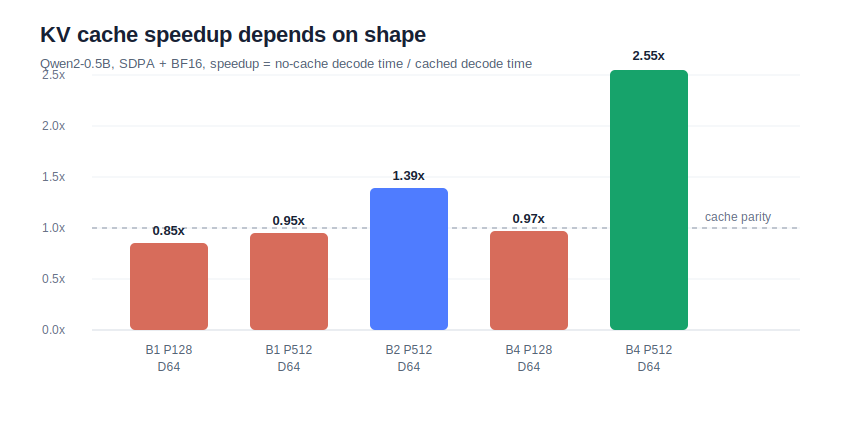

# Project 3 Stage 2: Qwen2 KV Cache vs No-Cache Decode

Date: 2026-07-07

This report compares cached autoregressive decode against a no-cache baseline for the Qwen2-0.5B VLA-style inference stack. The goal is to make the KV-cache tradeoff observable instead of assuming that cache is always faster for every shape.

## Setup

| Item | Value |
| --- | --- |
| GPU | NVIDIA GeForce RTX 4080 SUPER, 32 GiB |
| PyTorch | 2.8.0+cu128 |
| Model | `Qwen/Qwen2-0.5B-Instruct` |
| dtype | BF16 |
| attention | PyTorch SDPA |
| cached path | prefill once, then decode one token at a time with `past_key_values` |
| no-cache path | decode one token at a time by recomputing the full prompt plus generated prefix |
| benchmark script | `project3_vla_infer/benchmarks/bench_qwen2_kv_cache.py` |
| result CSV | `project3_vla_infer/results/qwen2_kv_cache_compare_sdpa_bf16.csv` |

## Sweep

| Dimension | Values |
| --- | --- |
| batch size | 1, 2, 4 |
| prompt length | 128, 512 tokens |
| decode length | 16, 32, 64 tokens |
| repeats | 3 |

## Results

A cache speedup above 1.0 means KV cache is faster. Values below 1.0 mean the no-cache recompute path is faster for that small shape.

| Batch | Prompt | Decode | Cached TPOT | No-cache TPOT | Speedup |
| ---: | ---: | ---: | ---: | ---: | ---: |
| 1 | 128 | 64 | 12.73 ms | 10.76 ms | 0.85x |
| 1 | 512 | 64 | 11.77 ms | 11.22 ms | 0.95x |
| 2 | 512 | 64 | 12.34 ms | 17.18 ms | 1.39x |
| 4 | 128 | 64 | 11.96 ms | 11.58 ms | 0.97x |
| 4 | 512 | 64 | 12.09 ms | 30.84 ms | 2.55x |

## Interpretation

The result has an important serving-systems lesson: **KV cache has overhead, and its benefit depends on shape.**

For short prompts (`prompt_len=128`), the Hugging Face cached decode path is not faster in this benchmark. The model is small, the prompt is short, and the overhead of cache objects, attention masks, and per-step Python/model plumbing is enough to offset the avoided recompute.

For larger effective workloads, KV cache becomes clearly useful. At `batch=4`, `prompt_len=512`, `decode_len=64`, cached decode is **2.55x faster** than no-cache recompute. The no-cache TPOT rises to 30.84 ms because every generated token reprocesses the full prefix, while cached TPOT remains around 12 ms.

This is exactly the design pressure behind vLLM-style serving systems:

- cache is most valuable when context length and/or batch size make recomputation expensive;
- cache is not free, so cache layout and scheduling matter;
- benchmark metrics should separate prefill, decode, TTFT, TPOT, memory, and shape-specific throughput.

## VLA Relevance

For VLA inference, a robot control loop often reuses a large visual/task context and repeatedly predicts action tokens or action chunks. This experiment suggests:

- short one-off calls may not benefit much from cache in a small model;
- batched environments or longer visual/task contexts benefit strongly;
- KV-cache memory layout and batching policy are real deployment constraints, not just model-level details.

## Next Experiments

The next Project 3 step is attention implementation comparison:

1. SDPA vs eager attention on the same benchmark shapes;
2. FlashAttention 2 if the environment installs cleanly;
3. then attach a simplified VLA action head and benchmark action post-processing with Triton fusion.
