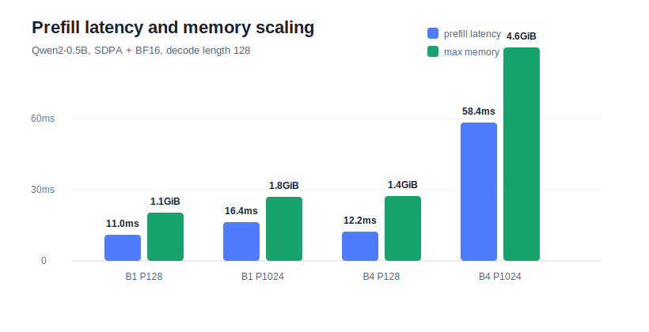

# Project 3 Stage 1: Qwen2 Prefill / Decode Baseline

Date: 2026-07-07

This report establishes the first inference baseline for Project 3: a Qwen2-0.5B based VLA-style inference stack. The goal is to measure the serving-style metrics that matter before adding FlashAttention variants, explicit KV-cache experiments, and Triton fused action-head kernels.

The benchmark follows a vLLM-inspired measurement split:

- prefill latency for the prompt/context phase;
- cached decode latency for the autoregressive phase;
- estimated TTFT: `prefill_ms + TPOT`;
- TPOT: decode time per generated token;
- decode tokens/s;
- max CUDA memory.

## Setup

| Item | Value |
| --- | --- |
| Host | AutoDL Project 3 instance |
| GPU | NVIDIA GeForce RTX 4080 SUPER, 32 GiB |
| Python | 3.12.3 |
| PyTorch | 2.8.0+cu128 |
| CUDA runtime | 12.8 |
| Model | `Qwen/Qwen2-0.5B-Instruct` from ModelScope cache |
| dtype | BF16 |
| attention | PyTorch SDPA |
| cache | Hugging Face `past_key_values` |
| benchmark script | `project3_vla_infer/benchmarks/bench_qwen2_prefill_decode.py` |
| result CSV | `project3_vla_infer/results/qwen2_prefill_decode_sdpa_bf16.csv` |

## Sweep

| Dimension | Values |
| --- | --- |
| batch size | 1, 2, 4 |
| prompt length | 128, 512, 1024 tokens |
| decode length | 32, 128 tokens |
| repeats | 3 |

## Key Results

### Decode Throughput

For cached decode, TPOT is fairly stable around 11-12 ms/token. Increasing batch size mainly increases aggregate decode tokens/s because each decode step emits more tokens in parallel.

| Batch | Prompt | Decode | TPOT | Decode tokens/s | Max memory |
| ---: | ---: | ---: | ---: | ---: | ---: |
| 1 | 128 | 128 | 11.37 ms | 88.0 | 1,071 MiB |
| 2 | 128 | 128 | 11.91 ms | 168.0 | 1,186 MiB |
| 4 | 128 | 128 | 11.74 ms | 340.8 | 1,421 MiB |
| 4 | 1024 | 128 | 12.28 ms | 325.6 | 4,696 MiB |

### Prefill And Memory Scaling

Prefill is sensitive to both batch size and prompt length. At batch 4, increasing prompt length from 128 to 1024 tokens raises prefill latency from 12.2 ms to 58.4 ms and max memory from 1.4 GiB to 4.7 GiB.

| Batch | Prompt | Decode | Prefill | Estimated TTFT | Max memory |
| ---: | ---: | ---: | ---: | ---: | ---: |
| 1 | 128 | 128 | 11.0 ms | 22.4 ms | 1,071 MiB |
| 1 | 1024 | 128 | 16.4 ms | 28.0 ms | 1,880 MiB |
| 4 | 128 | 128 | 12.2 ms | 24.0 ms | 1,421 MiB |
| 4 | 1024 | 128 | 58.4 ms | 70.7 ms | 4,696 MiB |

## Interpretation

The first baseline shows three useful inference-infra patterns:

1. **Decode is cache-driven and step-serial.** With KV cache enabled, decode time scales roughly linearly with generated length. The TPOT stays near 11-12 ms/token across prompt lengths, so aggregate tokens/s mainly comes from batch parallelism.
2. **Longer prompts hurt prefill and memory more than TPOT.** Prompt length 1024 increases prefill latency and cache memory substantially, while decode TPOT only moves moderately.
3. **Batching improves throughput but is not free.** Batch 4 reaches about 341 tokens/s at prompt 128, but at prompt 1024 memory grows to about 4.7 GiB and throughput drops to about 326 tokens/s.

For VLA-style inference, this maps naturally to closed-loop robot control:

- large visual/task context belongs to the prefill side;
- repeated action-token or action-chunk generation belongs to the cached decode side;
- batching multiple environments improves throughput, but the prefill/KV memory footprint becomes a real deployment constraint.

## Next Experiments

The next Project 3 steps are:

1. explicit no-cache vs KV-cache decode comparison;
2. SDPA vs eager attention, and FlashAttention if installation is stable;
3. simplified VLA action head attached to Qwen2 hidden states;
4. Triton fused action post-processing kernel for action denormalization, clamp, and mask.
