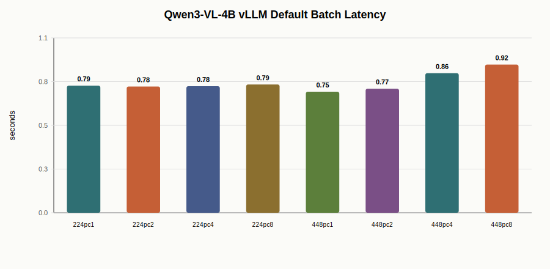

# Project 3 Stage: Qwen3-VL vLLM Serving Baseline

Date: 2026-07-08

This stage adds a real vLLM-based VLM serving baseline to Project 3. It uses `Qwen/Qwen3-VL-4B-Instruct` with single-image prompts and measures concurrency scaling on a 32 GiB AutoDL GPU. The goal is to separate general VLM serving behavior from the later Pi0.5 VLA action-inference path.

## Scope

| Item | Value |
| --- | --- |
| Model | Qwen3-VL-4B-Instruct |
| Runtime | vLLM 0.24.0 |
| Python | 3.12 |
| PyTorch | 2.8.0 + CUDA 12.8 |
| GPU memory | 32 GiB class GPU |
| dtype | BF16 |
| max model length | 2048 |
| max new tokens | 64 |
| image sizes | 224, 448 |
| concurrency | 1, 2, 4, 8 |
| memory measurement | `nvidia-smi` 200 ms sampling |

The benchmark uses a synthetic single-image prompt with a simple cabinet drawing. This is enough for serving-system profiling because the measured path includes Qwen3-VL image processing, multimodal prompt rendering, vLLM scheduling, prefill/decode, and output token generation.

## Engineering Notes

Several environment issues were resolved before the benchmark was stable:

1. vLLM multiprocessing with `spawn` cannot run from `python - <<'PY'` because worker startup tries to reload the main script from `<stdin>`. The smoke test and benchmark must be real `.py` files.
2. A previously installed `flash-attn` wheel was ABI-incompatible with PyTorch 2.8 / CUDA 12.8 and failed with an undefined `c10_cuda_check_implementation` symbol. The stable path was to uninstall `flash-attn` and let vLLM use its own backend path.
3. Parent-process `torch.cuda.max_memory_allocated()` is not reliable for vLLM because the engine runs in worker processes. Peak memory is therefore taken from `nvidia-smi` sampling.
4. The eager run disables CUDA Graph and torch compile. The default non-eager run is the better serving baseline, while eager remains a conservative fallback.

## Results: Eager Baseline

| Image | Concurrency | Latency (s) | Req/s | Output tok/s |
| ---: | ---: | ---: | ---: | ---: |
| 224 | 1 | 0.744 | 1.34 | 61.8 |
| 224 | 2 | 1.101 | 1.82 | 100.8 |
| 224 | 4 | 1.098 | 3.64 | 188.5 |
| 224 | 8 | 1.005 | 7.96 | 402.0 |
| 448 | 1 | 0.953 | 1.05 | 60.8 |
| 448 | 2 | 0.981 | 2.04 | 100.9 |
| 448 | 4 | 1.064 | 3.76 | 214.3 |
| 448 | 8 | 1.081 | 7.40 | 432.1 |

Peak memory from `nvidia-smi`: **21,833 MiB**.

## Results: Default vLLM

| Image | Concurrency | Latency (s) | Req/s | Output tok/s |
| ---: | ---: | ---: | ---: | ---: |
| 224 | 1 | 0.786 | 1.27 | 77.6 |
| 224 | 2 | 0.781 | 2.56 | 137.1 |
| 224 | 4 | 0.783 | 5.11 | 262.0 |
| 224 | 8 | 0.793 | 10.08 | 508.3 |
| 448 | 1 | 0.749 | 1.34 | 77.5 |
| 448 | 2 | 0.767 | 2.61 | 130.4 |
| 448 | 4 | 0.863 | 4.63 | 231.7 |
| 448 | 8 | 0.916 | 8.73 | 480.2 |

Peak memory from `nvidia-smi`: **21,801 MiB**.





## Eager vs Default

| Image | Concurrency | Eager req/s | Default req/s | Delta |
| ---: | ---: | ---: | ---: | ---: |
| 224 | 1 | 1.34 | 1.27 | -5.3% |
| 224 | 2 | 1.82 | 2.56 | +41.1% |
| 224 | 4 | 3.64 | 5.11 | +40.3% |
| 224 | 8 | 7.96 | 10.08 | +26.7% |
| 448 | 1 | 1.05 | 1.34 | +27.3% |
| 448 | 2 | 2.04 | 2.61 | +27.9% |
| 448 | 4 | 3.76 | 4.63 | +23.3% |
| 448 | 8 | 7.40 | 8.73 | +18.0% |

Default vLLM is clearly better for concurrent serving. The only regression is the `224, concurrency=1` case, where eager is slightly faster. For the actual serving objective, default mode is the stronger baseline because throughput increases substantially once concurrency is greater than one, while peak memory stays roughly unchanged.

## Main Takeaways

1. Qwen3-VL-4B BF16 can serve single-image multimodal prompts through vLLM on a 32 GiB GPU with about **21.3 GiB** peak memory.
2. Default vLLM reaches **10.08 req/s** at `224, concurrency=8` and **8.73 req/s** at `448, concurrency=8`.
3. Moving from concurrency 1 to 8 improves request throughput by about **7.9x** for 224 images and **6.5x** for 448 images in the default vLLM path.
4. Batch latency remains under about one second across the tested shapes, which shows that vLLM batching amortizes much of the multimodal request overhead.
5. This stage is a real VLM serving result, not a VLA policy result. It should be paired with the next Pi0.5/LeRobot action-inference stage for the real VLA story.

## Reproduction

```bash
export MODEL_DIR=/root/autodl-tmp/vla-infra-project3/modelscope/models/Qwen--Qwen3-VL-4B-Instruct/snapshots/master
export VLLM_USE_FLASHINFER_SAMPLER=0
export VLLM_WORKER_MULTIPROC_METHOD=spawn

python project3_vla_infer/benchmarks/bench_qwen3vl_vllm.py \
  --model-dir "$MODEL_DIR" \
  --image-sizes 224,448 \
  --concurrency 1,2,4,8 \
  --max-new-tokens 64 \
  --warmup 3 \
  --repeat 5 \
  --out project3_vla_infer/results/qwen3vl_vllm_default_concurrency.csv

python project3_vla_infer/benchmarks/bench_qwen3vl_vllm.py \
  --model-dir "$MODEL_DIR" \
  --image-sizes 224,448 \
  --concurrency 1,2,4,8 \
  --max-new-tokens 64 \
  --warmup 3 \
  --repeat 5 \
  --enforce-eager \
  --out project3_vla_infer/results/qwen3vl_vllm_eager_concurrency.csv
```
