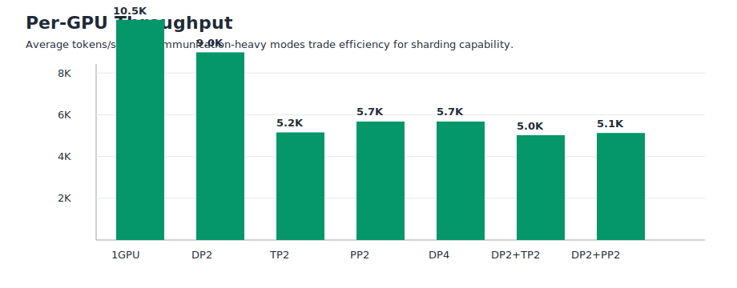
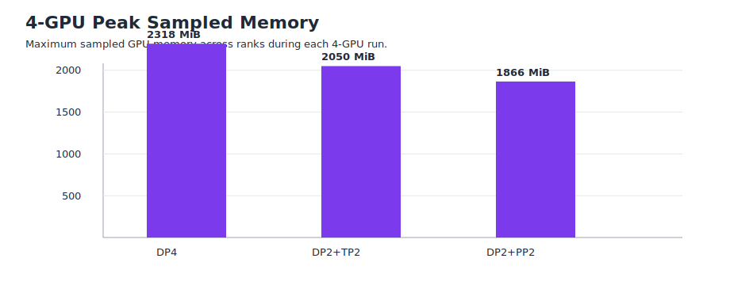

# Qwen2-MoE 4-GPU Distributed Composition on RTX 3090

Date: 2026-07-07

This report records the 4xRTX 3090 completion milestone for the Qwen2-MoE training-infrastructure project. Since an 8-GPU instance was not available, the final scaling target was adapted to 4 GPUs while preserving the core infrastructure goals: validate independent and composed distributed axes, checkpoint layout, MoE execution, profiling, and expert-parallel readiness.

## Summary Figures







## Environment

| Item | Value |
| --- | --- |
| Cloud | AutoDL / SeeTaCloud |
| GPUs | 4x NVIDIA GeForce RTX 3090, 24 GiB each |
| Python | 3.10.8 |
| PyTorch | 2.1.2+cu118 |
| CUDA build | 11.8 |
| Nanotron | 0.4 checkout from `huggingface/nanotron` |
| Model | Qwen2-MoE, 4 layers, hidden size 512, 8 experts, top-k=1 |
| Precision | BF16 |
| Attention | FlashAttention 2 |
| Expert MLP | GroupedGEMM |
| Data | Nanotron dummy data, sequence length 512 |

All successful 4-GPU runs used approximately the same global batch size: `2.05K` tokens per iteration.

## 4-GPU Results

| Case | GPUs | DP | TP | PP | EP | Avg tokens/s | Avg tokens/s/GPU | Avg step time | Peak sampled memory | Checkpoint |
| --- | ---: | ---: | ---: | ---: | ---: | ---: | ---: | ---: | ---: | --- |
| DP4 | 4 | 4 | 1 | 1 | 1 | 22,686 | 5,671 | 90.29 ms | 2,318 MiB | saved |
| TP2+DP2 | 4 | 2 | 2 | 1 | 1 | 20,071 | 5,019 | 101.97 ms | 2,050 MiB | saved |
| PP2+DP2 | 4 | 2 | 1 | 2 | 1 | 20,500 | 5,127 | 99.99 ms | 1,866 MiB | saved |

## Configs

- [`config_qwen2_moe_dp4_4gpu_100step.yaml`](../configs/qwen2_moe/config_qwen2_moe_dp4_4gpu_100step.yaml)
- [`config_qwen2_moe_tp2_dp2_4gpu_100step.yaml`](../configs/qwen2_moe/config_qwen2_moe_tp2_dp2_4gpu_100step.yaml)
- [`config_qwen2_moe_pp2_dp2_4gpu_100step.yaml`](../configs/qwen2_moe/config_qwen2_moe_pp2_dp2_4gpu_100step.yaml)
- [`config_qwen2_moe_ep2_dp2_4gpu_20step.yaml`](../configs/qwen2_moe/config_qwen2_moe_ep2_dp2_4gpu_20step.yaml)

## Checkpoint Evidence

DP4 checkpoint includes DP random states for all four ranks:

```text
random/tp-0-of-1_dp-0-of-4_pp-0-of-1.pt
random/tp-0-of-1_dp-1-of-4_pp-0-of-1.pt
random/tp-0-of-1_dp-2-of-4_pp-0-of-1.pt
random/tp-0-of-1_dp-3-of-4_pp-0-of-1.pt
```

TP2+DP2 checkpoint includes both TP and DP rank structure:

```text
optimizer/optimizer_pp-0-of-1_tp-0-of-2_exp-0-of-1.pt
optimizer/optimizer_pp-0-of-1_tp-1-of-2_exp-0-of-1.pt
random/tp-0-of-2_dp-0-of-2_pp-0-of-1.pt
random/tp-0-of-2_dp-1-of-2_pp-0-of-1.pt
random/tp-1-of-2_dp-0-of-2_pp-0-of-1.pt
random/tp-1-of-2_dp-1-of-2_pp-0-of-1.pt
```

PP2+DP2 checkpoint includes both PP and DP rank structure:

```text
optimizer/optimizer_pp-0-of-2_tp-0-of-1_exp-0-of-1.pt
optimizer/optimizer_pp-1-of-2_tp-0-of-1_exp-0-of-1.pt
random/tp-0-of-1_dp-0-of-2_pp-0-of-2.pt
random/tp-0-of-1_dp-0-of-2_pp-1-of-2.pt
random/tp-0-of-1_dp-1-of-2_pp-0-of-2.pt
random/tp-0-of-1_dp-1-of-2_pp-1-of-2.pt
```

## Expert Parallel Readiness

Conceptually, `ep=2, dp=2, tp=1, pp=1` is the right 4-GPU EP composition because `EP * DP * TP * PP * CP = 4`.

The current Nanotron checkout did not support this directly. The first blocker was in `ParallelContext`: the world-size assertion omitted `expert_parallel_size`. After applying a minimal local fix, process-group initialization advanced, but the run failed in the MoE expert compute path:

```text
RuntimeError: Expected batch_sizes.size(0) == num_experts to be true, but got false.
```

This indicates that with `expert_parallel_size=2`, local expert count and router-dispatched token counts are not yet consistently wired into GroupedGEMM. The relevant project patch is archived in [`../patches/nanotron_4gpu_project_patches.patch`](../patches/nanotron_4gpu_project_patches.patch).

This project therefore does not claim true EP training. It claims EP readiness analysis: process-group mismatch was identified, a minimal initialization fix was tested, and the next blocker was localized to MoE local expert accounting / token dispatch before GroupedGEMM.

## Interpretation

DP4 gives the highest total throughput in this small-model regime because it avoids model-parallel communication in the forward path. TP2+DP2 and PP2+DP2 are slightly slower but validate more complex sharding modes that become necessary for larger models. PP2+DP2 shows lower peak sampled memory than DP4 because model parameters are split across pipeline stages, though the 4-layer model has an imbalanced split.

The core result is not a benchmark claim. It is a reproducible infrastructure claim: on commodity 3090 hardware, the project validates Qwen2-MoE training under single GPU, DP, TP, PP, composed 4-GPU DP/TP/PP modes, checkpointing, resume, profiling, and EP implementation-gap analysis.

## Limitations

- Dummy data avoids real VLA dataloader bottlenecks.
- Single-node PCIe 3090 communication does not represent multi-node RDMA/IB behavior.
- EP is not complete; it requires local/global expert id mapping and token dispatch fixes.
- The model is intentionally small, so communication overhead dominates TP/PP speedup behavior.
